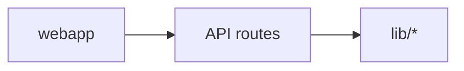
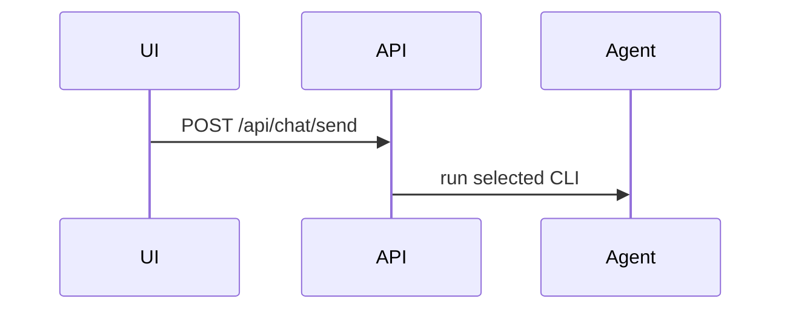

# wiki-ingest

## LLM Wiki Pattern Reference

This skill instantiates the repository-root [`llm-wiki.md`](../../../llm-wiki.md)
pattern: the user curates immutable `raw/` sources, and the LLM incrementally
builds a persistent, interlinked Markdown wiki instead of re-deriving knowledge
from raw documents at query time. The concrete CLIO rules in `AGENTS.md`,
`CLAUDE.md`, and this skill specialize that pattern for resumable chunking,
Code Wiki output, graph updates, and Korean wiki writing.

## Purpose

Read material newly dropped by the user into `raw/` and perform the following.

1. Write one `wiki/sources/<YYYY>/<YYYY-MM>/<slug>.md` summary page per original source.
2. Create or update related entity/concept pages, reusing existing pages instead of creating near-duplicates (see Step 2.3).
3. If a leaf is code-heavy, create or update Code Wiki pages under `wiki/code/<project>/` by mirroring the source directory structure, writing one file-level page per code file beside a per-directory `index.md`, plus architecture/testing/debug notes, code locations, and Mermaid diagrams.
4. Keep `wiki/index.md` and `wiki/log.md` consistent.
5. Graph synchronization is **not** performed by this skill. The webapp triggers `wiki-graphify` as separate invocations after ingest progress is detected. Ingest workers must not run graphify or write anything under `wiki/graph/`.

This skill **always follows the leaf-first + merge pass** principle, and is built
to survive interruption (OOM, SIGTERM, manual cancel) because progress is
externalized to `wiki/.progress/ingest/`.

## Triggers

- `/ingest <path|URL>` — chat slash command. Processes **exactly one
  sub-chunk** and exits, per the `unitPerCall: "one_subchunk"` contract. The
  user (or the webapp) re-invokes `/ingest` to advance.
- `/ingest-loop <path|URL>` — same skill body, but driven by the webapp's
  backend loop in `/api/chat/send` (`kind="ingest-loop"`). The backend keeps
  spawning a fresh CLI invocation per sub-chunk until
  `wiki/.progress/ingest/.state.json` reports no remaining `pending`,
  `in_progress`, or `partial` sub-chunks and `merge_pass.status === "done"`,
  or until the user clicks "Stop loop" (which drops
  `wiki/.progress/ingest/.stop`). Each iteration must still process exactly
  one sub-chunk and exit — the skill never loops itself.
- `/ingest` with no argument — incremental ingest for all of `raw/`.
- Natural-language triggers: "summarize this material", "I added something new to raw", "ingest ...".
- UI: chat input `+` menu -> ingest.
- Explorer: after a file is added/updated under `raw/`, the banner trigger button for "The LLM recommends updating the wiki".

## Input

- Single file path, such as `raw/foo.pdf` or `raw/notes/bar.md`.
- Code repositories or source trees under `raw/`, including approved symlinks.
- Single URL, downloaded to `raw/<slug>.<ext>` before processing.
- Folder path, such as `raw/dir/`, including its subtree. If the folder or a
  descendant entry is a user-approved symlink located under `raw/`, follow it
  read-only while preserving logical `raw/...` paths in state, source
  frontmatter, citations, and logs.
- If input is omitted, default to all of `raw/`.

## Output

- List of new/updated `wiki/**` Markdown files.
- For code-heavy inputs, graph-ready Code Wiki pages under `wiki/code/<project>/`, including one mirrored file page for each code file and an `index.md` summary in every mirrored source directory.
- Session Markdown with chat log: `sessions/<date>/<time>_ingest.md` (conversation only).
- Externalized progress: `wiki/.progress/ingest/.state.json` + `wiki/.progress/ingest/leaves/<hash>.json` + human-readable `wiki/.progress/ingest/DASHBOARD.md`.
- Ingest entries appended to `wiki/log.md`.
- Optional updates under `wiki/graph/`.

## Memory Safety: Why Progress Lives Outside The Session

Large `raw/` trees previously caused coding-agent CLIs to be killed by OOM. Two
patterns made that worse:

- The session markdown grew with each turn and was re-injected into every
  stateless CLI invocation, so prompt size scaled with N turns.
- One LLM call attempted to load an entire leaf (many files) at once, which
  blew up working-set memory.

The mitigation is structural, not a bigger machine. **One LLM invocation = one
sub-chunk.** All resume information lives in `wiki/.progress/ingest/`, so the
next invocation reads the state file (small) instead of replaying the whole
conversation. The host webapp also slims the prompt to the last N turns
(`chat.contextTurns`) and appends a one-line reference to the dashboard.

## Preflight

1. Confirm that `wiki/index.md` and `wiki/log.md` exist. If missing, create Phase 1 templates first.
2. Validate that the requested input path is lexically inside `raw/` after
   normalizing `.` and `..`. **Reject direct processing outside `raw/`.**
   User-approved symlink entries located under `raw/` are valid source entries:
   follow them read-only even if their real target is outside the repository,
   but keep every recorded path in logical `raw/...` form and never write to
   the symlink target. Reject broken symlinks and symlink loops with a clear
   warning.
3. Read knobs from `config/default.json` (merged with `config/local.json`):
   - `chunking.maxFiles`, `chunking.maxBytes` — soft cap per chunk.
   - `chunking.maxFilesPerInvocation` — **hard cap per LLM call**. Defaults to 4.
   - `chunking.maxBytesPerFile` — files above this read head + tail only.
   - `chunking.unitPerCall` — defaults to `"one_subchunk"`. Honor this strictly.
4. If the host coding-agent CLI is stateless (`claude -p`, `codex exec`, …), the
   host already slim-injects: a short dashboard reference + last N turns. Do
   **not** ask for the whole session markdown back.
5. If the target may contain code, scan only filenames/manifests first to
   classify leaves. Do not open many source files just to decide whether the
   input is code.
6. If code leaves are present, run the deterministic code indexer for the
   project or leaf before writing Code Wiki pages:
   ```bash
   node scripts/code-index.mjs raw/<project-or-leaf> --format=json
   node scripts/code-index.mjs raw/<project-or-leaf> --format=markdown
   ```
   Use the JSON for symbol/dependency evidence and the Markdown output as the
   first draft for `wiki/code/<project>/locations.md` and `diagrams.md`.

## Code Auto-Detection

`/ingest` and `/ingest-loop` are the only user-facing commands. There is no
separate Code Wiki command. During leaf enumeration, classify each leaf as
`prose`, `code`, `mixed`, or `ignore`.

Treat a leaf as `code` or `mixed` when it contains any of:

- Source files: `.ts`, `.tsx`, `.js`, `.jsx`, `.mjs`, `.cjs`, `.py`, `.rs`,
  `.go`, `.java`, `.kt`, `.swift`, `.c`, `.cc`, `.cpp`, `.h`, `.hpp`, `.cs`,
  `.php`, `.rb`, `.sh`, `.sql`.
- Project/config files: `package.json`, `Cargo.toml`, `pyproject.toml`,
  `go.mod`, `pom.xml`, `build.gradle`, `Dockerfile`, `compose.yaml`,
  `tsconfig.json`.
- Tests: filenames containing `test`, `spec`, `__tests__`, `tests/`.
- Runtime evidence: stack traces, CI logs, failing test output, or issue
  reproduction notes.

Treat these as `ignore` unless explicitly requested: `.git/`, `node_modules/`,
`dist/`, `build/`, `target/`, `.next/`, `.venv/`, `vendor/`, coverage output,
lockfile-only leaves, generated bundles, and binary assets.

Record the classification in `wiki/.progress/ingest/.state.json` per leaf:

```json
{
  "leaves": {
    "raw/repos/foo/src/": {
      "kind": "code",
      "project": "foo",
      "code_outputs": []
    }
  }
}
```

Use the nearest project manifest or the first directory under `raw/` as the
`project` name.

## Workflow

### Step 0 — Use Session and Acquire Lock

1. Use the active chat session supplied by the host.
   - If the prompt includes `Active session log: sessions/<path>.md`, treat that
     session as already created. **Do not create another `sessions/*.md` file.**
   - If no active session is supplied because the skill is being run directly
     outside the webapp/CLI adapter, create one chat log session file
     `sessions/<YYYY-MM-DD>/<HHMMSS>_ingest_<subject>.md` (frontmatter only).
   - This file holds the conversation, not progress.
2. Ensure `wiki/.progress/ingest/` exists. Create `leaves/`, `tmp/` subfolders if missing.
3. Attempt to acquire `wiki/.progress/ingest/.lock`:
   - File contents: `{"pid": <int>, "started_at": <ISO8601>, "session": "<rel path>"}`.
   - Write via `tmp/<rand>.lock` then rename — atomic on POSIX.
   - If `.lock` already exists and `pid` is alive, **abort** with a chat message: "Another `/ingest` is in progress (pid=…, session=…). Wait for it to finish or remove the lock manually." Do not proceed.
4. Read `wiki/.progress/ingest/.state.json` if it exists. If `version` mismatches the current SKILL version, run the migration in §State Migration before proceeding.

### Step 1 — Enumerate Leaves (idempotent)

1. From the requested input root (default `raw/`), list every leaf directory (no child directories) **and every direct-file pseudo-leaf**: if a directory has source files directly inside it as well as child directories, create a separate leaf unit for those direct files using that directory's logical `raw/.../` path. This is required for code repositories whose project root or parent modules contain files such as `package.json`, `src/index.ts`, route files, or config files alongside child directories. A single file or URL counts as a virtual leaf whose path is its parent directory. Follow symlinked files/directories that are located under `raw/`, but track visited real paths/inodes to avoid cycles and do not traverse the same real directory twice under one target.
2. For each leaf compute a stable identity:
   - `leafPath` = POSIX-style relative path (always ends with `/`), using the
     logical `raw/...` path even when the leaf is reached through a symlink.
   - `hash` = sha1 of `JSON.stringify(sortedFileList.map(f => [f.path, f.size, f.mtimeMs]))`, where `f.path` is the logical `raw/...` path and `size`/`mtimeMs` are read from the target file.
3. Update `wiki/.progress/ingest/.state.json`:
   - New leaves are added with `status: "pending"`, an empty `sub_chunks` list, and `attempts: 0`.
   - Existing leaves whose `hash` changed have their status reset to `"pending"` and their `sub_chunks` cleared. (Re-ingest is intentional when content changed.)
   - Leaves that no longer exist on disk get `status: "stale"`; do not delete them — the user may have moved files temporarily.
4. Plan sub-chunks for each `pending` leaf. A sub-chunk groups up to `chunking.maxFilesPerInvocation` files and stays under `chunking.maxBytes` total. Persist the sub-chunk plan into `.state.json` before any file is opened.
5. For code leaves, preserve module grouping when possible: keep related source,
   test, route, schema, and config files in the same sub-chunk if it does not
   exceed limits. Do not group generated/vendor files.

### Step 2 — Process **One** Sub-Chunk Per Invocation (the hard rule)

For exactly **one** sub-chunk whose `status === "pending"`:

1. Mark the sub-chunk `status: "in_progress"`, set `started_at`, increment `leaves[<leafPath>].attempts`. Persist immediately.
2. Open files **one at a time**, in the order recorded in the sub-chunk:
   - Read files through their logical `raw/...` paths. If a path crosses a
     symlink, treat the target as read-only source material and continue to
     cite/store only the logical `raw/...` path.
   - If the file is larger than `chunking.maxBytesPerFile`, read only `head (N/2)` + a marker + `tail (N/2)` bytes. Record `truncated: true` in the per-leaf JSON.
   - Write `wiki/sources/<YYYY>/<YYYY-MM>/<slug>.md` for that file with the required frontmatter (`title`, `type: source`, `tags`, `sources: [raw/...]`, `updated`) and optional source-page field `source_date: YYYY-MM-DD | YYYY-MM`.
   - Choose `<YYYY>/<YYYY-MM>` by this priority: explicit `source_date` or source text date -> raw path/metadata date -> raw file mtime -> ingest date. If only the year is known, use that year with the fallback month from the next available source.
   - Body: one-line gist → key points (max 12 bullets) → quotes → wiki connections (`[[Entity]]`, `[[Concept]]`) → source path/URL.
   - For code files, include these additional sections in the source summary:
     `## Code inventory`, `## Symbols`, `## Dependencies`, `## Locations`.
     Locations use `raw/...:L<line>` or `raw/...:L<start>-L<end>` when line
     numbers are known.
   - Update the per-leaf JSON entry: `processed: true`, `summary_page: "wiki/sources/<YYYY>/<YYYY-MM>/<slug>.md"`.
   - **Discard the file body from working memory** before opening the next file. Do not keep two file bodies in context simultaneously.
3. If the sub-chunk is code-heavy, update Code Wiki pages **from source summaries and symbol/dependency takeaways**:
   - A directory `index.md` is navigation and synthesis only. It never
     substitutes for file-level analysis: every code file represented in the
     sub-chunk still needs its own mirrored file page.
   - `wiki/code/<project>/overview.md` — project purpose, entry points,
     directories, build/test commands, and links to the mirrored directory
     indexes plus architecture/testing/API pages.
   - `wiki/code/<project>/<relative-dir>/index.md` — one page for every
     source directory represented by the sub-chunk, including the project root.
     Summarize that directory's purpose, direct files, child
     directories, important symbols, dependencies, tests, and risks. Parent
     directory indexes must summarize and link to their child directory
     indexes, so a reader can navigate top-down through the codebase. The
     page must have `type: code` frontmatter and include `directory` in
     `tags` so the backend can verify directory-index coverage.
   - `wiki/code/<project>/<relative-file-path>.md` — one page per code file in
     the sub-chunk, preserving the raw project-relative path and appending
     `.md` to the source filename. Example: `raw/repos/foo/src/server.ts`
     becomes `wiki/code/foo/src/server.ts.md`; `raw/repos/foo/src/index.md`
     becomes `wiki/code/foo/src/index.md.md`. Include the file role, key
     symbols, dependencies, important line locations, tests touching it, risks,
     and links to its `wiki/sources/...` source summary. The page must have
     required frontmatter with `type: code`, include `file` in `tags`, and
     mention the logical `raw/...` path so the backend can verify file-level
     coverage.
   - API/CLI/configuration/runbook pages stay near the directory that owns the
     implementation when that is clear, or at `wiki/code/<project>/apis/` for
     cross-cutting public surfaces.
   - `wiki/code/<project>/architecture.md` — system boundary, components,
     data/control flow, external dependencies, design decisions supported by
     evidence.
   - `wiki/code/<project>/testing.md` — test inventory, commands, covered
     modules, gaps, and recommended tests.
   - `wiki/code/<project>/debug-notes.md` — only when logs, stack traces, or
     failing tests are present.
   - `wiki/code/<project>/diagrams.md` — Mermaid diagrams for dependency and
     structure views. Explorer already renders fenced `mermaid` blocks.
   - Prefer locations and dependency edges from `scripts/code-index.mjs` over
     hand-written guesses. If the script misses a language feature, supplement
     it with targeted `rg` searches and mark uncertain line numbers as unknown
     instead of inventing them.
   Record every file-level page and any other Code Wiki pages written in the
   sub-chunk's `code_outputs`; do not mark a code/mixed leaf complete until
   each code file in that leaf has a valid mirrored file page under
   `wiki/code/<project>/...`, every direct source file in non-leaf directories
   has been covered by a direct-file pseudo-leaf, and every represented
   directory has an `index.md`.
   Use the internal helper skills `code-documentation`, `code-architecture`,
   `code-testing`, and `code-debug` as needed. They are implementation helpers,
   not separate user-facing commands.
4. Update entity/concept pages **from the takeaways only** (the per-leaf JSON), not by re-opening the raw files. If a raw file truly must be re-read, open it, read just the needed span, and close it before moving on.
   - **Reuse before creating.** Before adding a new `wiki/entities/` or `wiki/concepts/` page, check `wiki/index.md` for an existing page naming the same target — including case, spacing, punctuation, and English/Korean variants (`Transformer` ≈ `트랜스포머` ≈ `transformer-model`). If one exists, update it and link with the index's exact `[[Page Name]]`. Create a new page only when no existing page covers the target. Parallel workers each see only part of the input, so this is the main safeguard against near-duplicate pages — and therefore against duplicate, disconnected graph nodes.
5. **Contradictions**: if a new claim disagrees with an existing wiki page, add a block quote on that page:
   ```markdown
   > ⚠️ Conflicts with [[wiki/sources/<YYYY>/<YYYY-MM>/<slug>]]: this source claims X. Follow-up review needed.
   ```
6. Append a single chunk entry to `wiki/log.md`:
   ```markdown
   ## [YYYY-MM-DD HH:MM] ingest | <leaf path> | sub-chunk <id>
   - Changed files: `wiki/sources/2026/2026-05/foo.md`, `wiki/entities/bar.md`
   - Notes: <files done>/<files total> in leaf
   ```
7. Mark the sub-chunk `status: "done"`, set `ended_at`, record `source_pages_written` and any `code_outputs`. If this was the leaf's last sub-chunk, set `leaves[<leafPath>].status = "done"` **and queue the merge pass**: add the leaf's immediate parent directory (a POSIX path ending in `/`; use `raw/` for a leaf sitting directly under `raw/`) to `merge_pass.pending_parents` unless it is already listed. This is the only place `pending_parents` is filled — Step 3 and the `/ingest-loop` backend driver both rely on it to know merge work is outstanding, so skipping it leaves the loop unable to detect completion. Persist `.state.json`.
8. **Regenerate `wiki/.progress/ingest/DASHBOARD.md`** from `.state.json` (idempotent — overwrite, do not append).
9. **Release `.lock` and return.** Do **not** start the next sub-chunk in the same call. The next `/ingest` invocation will read `.state.json` and pick up the next `pending` sub-chunk.

If an exception is raised during this step:
- Set the sub-chunk `status: "error"`, store the error message in `leaves[<leafPath>].last_error`.
- Set the leaf `status: "partial"` (not `"error"` — other sub-chunks may still succeed).
- Persist and release the lock.

### Step 3 — Merge Pass (separate invocation, one parent per call)

Only run when **every** leaf in the input scope has `status === "done"` and `merge_pass.status !== "done"`.

1. Acquire the same lock with mode `merge`.
2. If `merge_pass.pending_parents` is empty there is nothing to merge: set `merge_pass.status = "done"`, regenerate `DASHBOARD.md`, release the lock, and return. Otherwise pick **one** parent directory from `merge_pass.pending_parents`. For that parent:
   - Combine child-leaf summaries into or onto `wiki/concepts/<topic>.md` (or wherever appropriate).
   - If useful, write/append the root synthesis note at `wiki/synthesis/<batch>.md`.
   - If the parent contains code leaves, consolidate `wiki/code/<project>/`
     pages, refresh parent directory `index.md` summaries so they accurately
     roll up child directories, and refresh `diagrams.md` so dependencies
     across leaves are shown.
3. Append a merge entry to `wiki/log.md`:
   ```markdown
   ## [YYYY-MM-DD HH:MM] ingest | merge pass | <parent>
   - Integrated pages: `wiki/concepts/foo.md`
   ```
4. Remove that parent from `merge_pass.pending_parents`. If empty, set `merge_pass.status = "done"` and reorder `wiki/index.md` in bulk now:
   - Category order: Entities → Concepts → Code → Sources → Answers → Comparisons → Lint Reports → Graph.
   - Sort alphabetically within each category.
   - Item format: `- [[Page Name]] — One-line summary`.
5. Regenerate `DASHBOARD.md`. Release lock. Return.

If `graph.autoUpdateOnIngest` is `true`, graph synchronization is handled as
separate coding-agent CLI invocations after ingest progress is detected. The
webapp may run scoped `wiki-graphify update` between loop iterations only when
`graph.autoUpdateStrategy` allows it (`auto` uses workload thresholds). A
scoped update rebuilds the completed leaf's partial graph and then merges all
valid `wiki/graph/parts/*.json` into the connected final `graph.json`. After
the final merge completes, always run `wiki-graphify update` as the quality
merge/normalization pass. Do not bundle graph work into the same merge-pass LLM
call; each graph step must be a follow-up invocation that uses the
`wiki-graphify` skill.

When CLIO runs ingest through multi-agent orchestration, skip all scoped
between-round graph updates. Run `wiki-graphify update` only once, after every
leaf is done and every merge-pass parent has been drained. This prevents graph
normalization from seeing a partial worker state and producing disconnected or
stale graph artifacts.

## Error Handling / Resume

- **Crash mid-call**: on next `/ingest`, any sub-chunk left in `status: "in_progress"` is demoted to `"pending"` if its `started_at` is older than 60 seconds and no live pid holds the lock. Resume from it.
- **Quota-style fatal errors**: stop the loop with a clear chat message. Do not silently retry — the next attempt would just reproduce the OOM.
- **Force re-run a leaf**: user can ask "re-ingest raw/foo/". Set that leaf's `status` back to `"pending"` and clear its `sub_chunks`; the next call processes it.
- **`wiki/.progress/ingest/.state.json` corrupted**: rename to `.state.json.bak.<ISO8601>`, re-enumerate from scratch. Warn the user in chat.

## Code Wiki Page Conventions

Code Wiki pages use the same frontmatter rules as normal wiki pages, with
`type: code` or `type: architecture`.

### Directory-Mirrored Layout

Mirror the source tree under `wiki/code/<project>/` instead of flattening code
files into a global `files/` directory. Keep these conventions:

- `wiki/code/<project>/overview.md` is the project-level orientation page.
- `wiki/code/<project>/<relative-dir>/index.md` summarizes one source
  directory. It links to direct file pages and child directory `index.md` pages.
- Parent `index.md` pages summarize the purpose and notable contents of child
  directories, not just list them.
- `wiki/code/<project>/<relative-file-path>.md` documents one source file by
  appending `.md` to the raw filename. This avoids collisions with directory
  `index.md` pages and preserves recognizability.
- Legacy pages under `wiki/code/<project>/files/` may be kept and updated when
  they already exist, but new Code Wiki output should use the mirrored layout.

Every Code Wiki page should include code location links when known:

```markdown
- `startServer()` — `raw/repos/foo/src/server.ts:L42-L88`
  ([open](/explorer?ws=raw&path=repos/foo/src/server.ts&line=42))
```

Use logical `raw/...` paths only. The Explorer link path omits the `raw/`
workspace prefix and may include `&line=<n>` to scroll/highlight the line. Keep
the full line span in nearby text. If a function/class line number is unknown,
include the file path and symbol name rather than guessing.

### `wiki/code/<project>/diagrams.md`

Create Mermaid diagrams when code structure or dependencies are discoverable.
Prefer small, readable diagrams over exhaustive hairballs.

Recommended sections:

````markdown
---
title: <Project> Diagrams
type: code
tags: [code, diagram, <project>]
sources: [...]
updated: YYYY-MM-DD
---

# <Project> Diagrams

## Module Dependencies



## Request / Control Flow


````

Use Mermaid node labels that match Code Wiki page names when possible, so graph
and wiki navigation stay aligned.

## Code Location Index

For projects with many code pages, write or update
`wiki/code/<project>/locations.md`:

```markdown
---
title: <Project> Code Locations
type: code
tags: [code, locations, <project>]
sources: [...]
updated: YYYY-MM-DD
---

# <Project> Code Locations

| Symbol | Kind | Location | Open |
|---|---|---|---|
| `runIngestLoop` | function | `raw/repos/foo/webapp/lib/ingest-loop.ts:L940-L1094` | [open](/explorer?ws=raw&path=repos/foo/webapp/lib/ingest-loop.ts&line=940) |
```

This is the Code Wiki's OpenGrok-like index: it should be compact, searchable,
and focused on important functions/classes/routes/config rather than every
private local variable.

## Prohibited (hard rules)

- Do **not** modify, delete, or move files under `raw/` or any real filesystem
  target reached through a `raw/` symlink.
- Do **not** delete wiki pages. Retire them by moving to `wiki/archive/<original-path>` with a one-line reason.
- Do **not** invent external URLs. If a source is ambiguous, mark it as "source unknown".
- Do **not** format, patch, build, or test source repositories under `raw/`
  during ingest. They are evidence. Actual code edits are separate coding tasks.
- Do **not** group files beyond `chunking.maxFilesPerInvocation` in one call.
- Do **not** process more than one sub-chunk per LLM invocation when `chunking.unitPerCall === "one_subchunk"`.
- Do **not** keep two raw file bodies in working memory at the same time within a single call.
- Do **not** re-inject the session markdown's entire history into your own reasoning context — read `wiki/.progress/ingest/.state.json` and the relevant per-leaf JSON instead.
- Do **not** run the merge pass and a sub-chunk in the same invocation.

## State Files

### `wiki/.progress/ingest/.state.json`

```json
{
  "version": 1,
  "updated_at": "2026-05-17T12:34:56.000Z",
  "config_snapshot": {
    "maxFilesPerInvocation": 4,
    "maxBytesPerFile": 131072,
    "unitPerCall": "one_subchunk"
  },
  "leaves": {
    "raw/articles/karpathy/": {
      "hash": "<sha1>",
      "status": "pending",
      "sub_chunks": [
        {
          "id": "c1",
          "files": ["raw/articles/karpathy/llm-wiki.md"],
          "status": "pending",
          "started_at": null,
          "ended_at": null,
          "source_pages_written": []
        }
      ],
      "last_error": null,
      "last_session": "sessions/2026-05-17/123456_ingest_karpathy.md",
      "attempts": 0,
      "part_file": "wiki/.progress/ingest/leaves/<sha1>.json"
    }
  },
  "merge_pass": {
    "status": "idle",
    "last_run_at": null,
    "pending_parents": []
  }
}
```

### `wiki/.progress/ingest/leaves/<hash>.json`

```json
{
  "leaf": "raw/articles/karpathy/",
  "files": [
    {
      "path": "raw/articles/karpathy/llm-wiki.md",
      "bytes": 12450,
      "sha1": "<sha1>",
      "processed": false,
      "summary_page": null,
      "truncated": false
    }
  ],
  "takeaways": [],
  "entities_touched": [],
  "concepts_touched": [],
  "contradictions": [],
  "next_action": "process files[0]"
}
```

Caps to apply on this file to prevent unbounded growth:
- `takeaways`: keep most recent 40 bullets. Older content is summarized into the takeaway header.
- `entities_touched` / `concepts_touched`: dedupe, alphabetical.
- `contradictions`: keep all (rare, important).

### `wiki/.progress/ingest/DASHBOARD.md`

Regenerated from `.state.json` after every sub-chunk. Format:

```markdown
# Ingest progress

- Updated: <ISO8601>
- Leaves: <done>/<total> done · <in_progress> in_progress · <pending> pending · <error> error
- Last activity: <leaf> — sub-chunk <id> (<status>)

| leaf | status | sub-chunks done/total | last_error | session |
| --- | --- | --- | --- | --- |
| `raw/articles/karpathy/` | done | 1/1 | — | `sessions/2026-05-17/123456_ingest_karpathy.md` |
| `raw/notes/2026-05/` | partial | 2/3 | rate limit | `sessions/2026-05-17/123456_ingest_karpathy.md` |

_Resume by running `/ingest` again — the next sub-chunk is picked from `.state.json` automatically. Or run `/ingest-loop` to let the webapp's backend driver keep re-spawning the CLI until every sub-chunk and the merge pass are done; click "Stop loop" in the chat UI to halt after the current sub-chunk._
```

## State Migration

If `state.version` is lower than the current SKILL's expected version:
1. Copy the file to `.state.json.bak.<ISO8601>`.
2. Migrate forward field-by-field. Do not drop unknown fields silently — note them in `wiki/log.md`.
3. Bump `version` and persist.

## Minimal Scenario: Single-File Ingest

User:
> `/ingest raw/articles/karpathy/llm-wiki.md`

Skill behavior on call #1:
1. Create session file, take the lock.
2. Enumerate: one leaf `raw/articles/karpathy/`, one sub-chunk `c1` with one file.
3. Step 2: read the file, write `wiki/sources/2026/2026-05/karpathy-llm-wiki.md`, update concept pages `wiki/concepts/llm-wiki-pattern.md`, `wiki/concepts/memex.md`, and entity pages `wiki/entities/andrej-karpathy.md`, `wiki/entities/vannevar-bush.md` from takeaways.
4. Mark sub-chunk `done`, leaf `done`. Update `.state.json`, regen DASHBOARD. Release lock. Return.

Call #2 (`/ingest` again with no arg):
1. State shows leaf `done`, `merge_pass.pending_parents = ["raw/articles/"]`. Run §Step 3 for that parent. Reorder index. Done.

## Related Skills

- [wiki-query](../wiki-query/SKILL.md) — searches the wiki and reuses answers fed back by ingest/query.
- [wiki-lint](../wiki-lint/SKILL.md) — periodic health check; catches accumulated contradictions after ingest.
- [wiki-graphify](../wiki-graphify/SKILL.md) — called after the merge pass, by separate invocation. Mirrors the same `.state.json` pattern used here.
- Optional: [wiki-search-qmd](../wiki-search-qmd/SKILL.md), [wiki-marp](../wiki-marp/SKILL.md), `wiki-images`.
