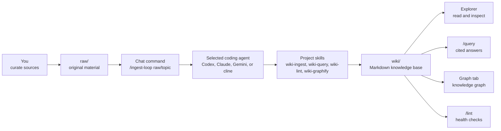

<p align="center">
  
</p>

# CLIO

**CLIO is a local-first LLM Wiki workbench.** Put source material in `raw/`, ask a coding agent to ingest it, and grow a durable Markdown wiki in `wiki/` that you can read, search, lint, graph, and improve over time.

CLIO packages Andrej Karpathy's LLM Wiki pattern into a runnable local project. The user stays in the curator role: you collect source material, decide what matters, and ask questions. The agent does the maintenance work: summarizing sources, creating concept/entity pages, updating indexes, recording logs, checking wiki health, and building graph artifacts.

## Why CLIO?

Most "chat with your documents" tools hide knowledge in a transcript or an opaque vector store. CLIO keeps the useful result in ordinary Markdown files.

| Capability | What it means |
|---|---|
| Local-first source library | Your original material lives in `raw/`; agents treat it as read-only. |
| Maintained Markdown wiki | Summaries, concepts, entities, answers, lint reports, and graph reports live in `wiki/`. |
| Agent-operated workflows | `codex`, `claude`, `gemini`, or `cline` can run `/ingest`, `/query`, `/lint`, and graph workflows. |
| Browser workbench | A Next.js UI provides Chat, Explorer, Graph, and Settings tabs. |
| Incremental processing | Large folders are processed leaf-first in small chunks, then merged into a coherent wiki. |
| Reviewable outputs | Wiki pages, logs, sessions, and graph JSON are files you can inspect and version. |

## How It Works



The important split is ownership:

| Path | Owner | Purpose |
|---|---|---|
| `raw/` | You | Original source files. CLIO and agents must not edit, move, or delete them. |
| `raw/chat/` | You via Chat | User-approved external captures from Chat, such as browser/search/tool findings, ready for later ingest. |
| `wiki/` | Agent | Generated and maintained Markdown wiki. |
| `wiki/sources/YYYY/YYYY-MM/` | Agent | One source summary page per original source. |
| `wiki/answers/` | Agent | Saved answers from query workflows. |
| `wiki/lint/` | Agent | Wiki health reports. |
| `wiki/graph/` | Agent + graphify | Graph JSON, graph report, partial graph state. |
| `sessions/` | System | Chat and CLI session records. |
| `.agents/skills/` | Project | Local instructions that define CLIO operations. |
| `webapp/` | Project | Next.js browser UI. |

## Quick Start

Install the latest GitHub release into `~/.clio`, run setup, and start the web app:

```bash
curl -fsSL https://raw.githubusercontent.com/hjhun/llm-wiki/main/scripts/install.sh | bash -s -- --start
cd ~/.clio
```

The installer defaults to `~/.clio`. Pass `--dir <path>` (or set `CLIO_INSTALL_DIR`)
to install somewhere else; the installer never overwrites an existing directory.

Open:

```text
http://127.0.0.1:9091
```

On the first visit, CLIO redirects to `/setup`. Set the administrator password, log in, then open **Settings** and choose the default coding agent CLI.

CLIO binds to `0.0.0.0` by default, so machines on the same trusted LAN can connect at `http://<server-ip>:9091`. To restrict the server to this machine:

```bash
./setup.sh --host 127.0.0.1 --start
```

## Prerequisites

The release installer needs:

- `bash`
- `tar`
- `curl` or `wget`

The project setup and full workflows need:

- Node.js `>=20`
- npm
- Python 3
- At least one supported coding agent CLI: `codex`, `claude`, `gemini`, or `cline`
- Optional: a Rust toolchain (`cargo`) to build the `clio` CLI — `setup.sh`
  skips the CLI build with a warning when `cargo` is missing
- Optional: `graphify`, `qmd`, and Marp CLI

`setup.sh` detects installed agent CLIs and writes the result to `config/cli-detected.json`. Missing CLIs can be installed manually or configured by path in Settings.

## First Wiki in Five Minutes

Copy the sample source into `raw/`:

```bash
mkdir -p raw/demo
cp examples/raw/llm-wiki-demo.md raw/demo/
```

In the **Chat** tab, run:

```text
/ingest-loop raw/demo
```

Then ask:

```text
/query Why is the leaf-first merge pass necessary in LLM Wiki?
```

Expected result:

- A source summary appears under `wiki/sources/YYYY/YYYY-MM/`.
- Related concept/entity pages may be created or updated.
- `wiki/index.md` and `wiki/log.md` are updated.
- The query answer cites wiki/source pages.

For a full walkthrough, read [docs/GUIDE.md](./docs/GUIDE.md). 한국어 안내서는 [docs/GUIDE_ko.md](./docs/GUIDE_ko.md)를 참고하세요.

## Core Workflows

Run these from the **Chat** tab:

| Command | Use it for |
|---|---|
| `/ingest raw/<path>` | Process one ingest sub-chunk, then stop. Useful for careful manual stepping. |
| `/ingest-loop raw/<path>` | Keep invoking ingest until the selected folder is complete. Transient CLI failures are retried and resume from saved progress. Recommended for normal use. |
| `/ingest-loop` | Incrementally ingest all of `raw/`. |
| `/query <question>` | Answer from the wiki first, with citations. |
| `/lint` | Check metadata, links, contradictions, index consistency, and sensitive information. |
| `/lint --fix` | Apply safe automatic fixes and write a lint report. |

Run graph workflows from the **Graph** tab:

| Button | What happens |
|---|---|
| Build | Requests `wiki-graphify build` through the selected coding agent. |
| Incremental Update | Requests `wiki-graphify update` through the selected coding agent. |

The web app does not execute `graphify` directly. The selected coding agent reads the `wiki-graphify` skill and uses the global `graphify` command from `PATH`, or `python3 -m graphify` when appropriate.

## Command-Line Interface (`clio`)

`setup.sh` builds a native Rust CLI and installs it to `<install-dir>/bin/clio`.
It runs the same operations as the Chat tab, so you can drive a wiki from a
terminal or a script.

Add it to your `PATH` (the installer prints this line when needed):

```bash
export PATH="$HOME/.clio/bin:$PATH"
```

| Command | What it does |
|---|---|
| `clio raw add <path>...` | Copy files or folders into `raw/`. Use `--symlink` to add links instead of copying bytes. Re-adding an existing path replaces it and moves the previous entry to `raw/.trash/`. |
| `clio raw remove <raw-path>...` | Soft-delete a file from `raw/` (moves it to `raw/.trash/`). |
| `clio raw list [raw-path]` | List files currently under `raw/`. |
| `clio ingest [path]` | Run one `/ingest` pass through the configured coding agent. |
| `clio ingest-loop` | Run `/ingest-loop` until the progress state is drained. |
| `clio query <question>` | Ask the wiki a question. |
| `clio lint [--fix]` | Run the wiki-lint health check. |
| `clio status` | Show the resolved project, webapp URL, and token status. |

`ingest`, `ingest-loop`, `query`, and `lint` call the **running webapp's HTTP
API**, so they behave exactly like the Chat tab — same coding agent, same
ingest-loop orchestration, same session logs. Start the webapp first
(`./setup.sh --start`). `raw` subcommands work offline; they only touch the
filesystem.

The CLI finds its project by checking `$CLIO_HOME`, then `~/.clio`, then
walking up from the current directory. It reads the webapp port and the
`auth.cliToken` from `config/local.json`. Override any of these with
`--home`, `--base-url`, or `--token` (or the matching `CLIO_*` env vars).

## Adding Your Own Raw Data

`raw/` is the only place you should put original material.

Recommended layout:

```text
raw/
├── articles/
│   └── 2026-05-llm-wiki/
│       ├── karpathy-llm-wiki.md
│       └── notes.md
├── papers/
│   └── retrieval/
│       └── paper.pdf
├── meetings/
│   └── 2026-05-17-project-kickoff.md
└── web-clips/
    └── graphify-readme.md
```

Tips:

- Prefer clear folder names by topic, project, date, author, or source type.
- Put related files in the same leaf folder so CLIO can summarize them together.
- Do not put secrets, API keys, private tokens, or unnecessary personal data into `raw/`.
- If a PDF or image is scanned and has no selectable text, OCR it first or add a companion `.md` note.
- After adding files, run `/ingest-loop raw/<folder>` or enable Auto Ingest in Settings.
- From a terminal, `clio raw add <file>` copies material in; `clio raw add --symlink <folder>` links an external folder; `clio ingest-loop` processes it.

## Web UI

| Tab | Purpose |
|---|---|
| Chat | Run `/ingest`, `/ingest-loop`, `/query`, `/lint`, or natural-language requests. |
| Explorer | Browse `raw/`, `wiki/`, and generated reports. |
| Graph | Build, update, and inspect the knowledge graph. |
| Settings | Configure agent CLI, server host/port, graph behavior, Auto Ingest, language, and password. |

## Setup Options

The release installer downloads a GitHub source tarball and then runs `setup.sh`.

```bash
curl -fsSL https://raw.githubusercontent.com/hjhun/llm-wiki/main/scripts/install.sh | bash -s -- --dir ./my-clio --skip-graphify --port 7788 --start
```

To update an existing install without touching `raw/` or `wiki/` data:

```bash
curl -fsSL https://raw.githubusercontent.com/hjhun/llm-wiki/main/scripts/install.sh | bash -s -- update --dir ./my-clio --skip-build
```

From inside the installed CLIO directory, `--dir` is optional:

```bash
bash scripts/install.sh update --skip-build
```

Installer options:

| Option | Description |
|---|---|
| `install` | Default command. Create a new install directory. |
| `update`, `upgrade` | Update an existing install from the selected release/ref. Preserves `raw/`, `wiki/`, `sessions/`, `config/local.json`, `.run/`, `webapp/node_modules/`, `webapp/.next/`, and `webapp/.env*`. |
| `--dir <path>` | Install directory. Default: `~/.clio`. The installer never overwrites an existing path. |
| `--version <ver>` | GitHub release tag to install, or `latest`. Default: `latest`. |
| `--ref <ref>` | GitHub tag, branch, or commit to install exactly. Overrides `--version`. |
| `--repo <repo>` | GitHub repo as `owner/name` or a `github.com` URL. Default: `hjhun/llm-wiki`. |
| `--no-setup` | Download and unpack only. |

Any other arguments are passed to `setup.sh`.

To install a specific release:

```bash
curl -fsSL https://raw.githubusercontent.com/hjhun/llm-wiki/main/scripts/install.sh | bash -s -- --version v0.1.0
```

Inside an installed or cloned checkout:

```bash
./setup.sh --help
```

Common `setup.sh` options:

| Option | Description |
|---|---|
| `--start` | Start the web server in the background after setup. |
| `--shutdown` | Stop the running CLIO web server. |
| `--no-restart` | With `--start`, fail if the target port is already in use. |
| `--port <n>` | Web UI port. Default: `9091`. |
| `--host <addr>` | Web UI host. Default: `0.0.0.0`. Use `127.0.0.1` for local-only. |
| `--dev` | Use the development server command. |
| `--skip-graphify` | Do not install or upgrade graphify. |
| `--skip-npm-install` | Skip `webapp/` dependency checks and installation. |
| `--skip-build` | Skip `npm run build`. |
| `--skip-cli` | Skip building the Rust `clio` CLI. |
| `--with-qmd` | Best-effort optional qmd setup. |
| `--with-marp` | Best-effort optional Marp CLI setup. |
| `--install-cli=<names>` | Best-effort CLI install for `codex`, `claude`, `gemini`, or `cline`. |

Runtime files are written under `.run/`:

```text
.run/webapp.pid
.run/webapp.log
```

## Start on Boot with systemd

On Ubuntu 22.04/24.04 or similar systemd hosts, install the web UI as a system service:

```bash
./systemd/install-clio-web-service.sh
```

The script prepares the web app, renders `systemd/clio-web.service` for the current checkout path and user, installs the unit, runs `systemctl daemon-reload`, enables it for `multi-user.target`, and restarts it. It uses `sudo` only for the systemd install/start steps, so Ubuntu will prompt for your password when needed.

By default the unit is installed into `/etc/systemd/system`, which is the safest local-administrator location. If you intentionally want the Ubuntu vendor-style unit directory, use:

```bash
./systemd/install-clio-web-service.sh --unit-dir vendor
```

On current Ubuntu releases, `vendor` selects `/usr/lib/systemd/system` when present and falls back to `/lib/systemd/system`. In both cases `systemctl enable clio-web.service` creates the appropriate `multi-user.target.wants/` symlink.

Useful commands:

```bash
sudo systemctl status clio-web.service
sudo journalctl -u clio-web.service -f
sudo systemctl restart clio-web.service
sudo systemctl disable --now clio-web.service
```

## Supported Agent CLIs

| CLI | Invocation shape |
|---|---|
| `codex` | `codex exec "<prompt>"` |
| `claude` | `claude -p "<prompt>"` |
| `gemini` | `gemini --prompt "<prompt>"` |
| `cline` | `cline -y "<prompt>"` |

Each CLI must be authenticated in the host environment where the web app runs. If Chat or Graph says that no default agent is configured, open Settings and choose one. If a Graph Build/Update request asks for an API key, it usually means the selected coding agent CLI is not logged in or the webapp process was started without the CLI's normal environment.

## Development

Clone and set up:

```bash
git clone https://github.com/hjhun/llm-wiki.git
cd llm-wiki
./setup.sh
```

Start development mode:

```bash
./setup.sh --start --dev --skip-build
```

Typecheck and build:

```bash
cd webapp
npm run typecheck
npm run build
```

Smoke test:

```bash
./scripts/smoke-test.sh
```

Create a GitHub release:

1. Add release notes under `docs/releases/vX.Y.Z.md`.
2. Open **Actions** -> **Release** -> **Run workflow**.
3. Enter a version tag such as `v0.2.0`.

The workflow validates release-critical scripts, creates the Git tag, and creates
the GitHub Release. `scripts/install.sh` installs that release when it is the
latest release, or when users pass `--version vX.Y.Z`.

## Project Structure

```text
.
├── .agents/skills/       # Project-local agent skills
├── .github/workflows/     # GitHub Actions release automation
├── cli-rs/               # Native Rust `clio` CLI source
├── config/               # Default and local configuration
├── docs/                 # User guides, QA notes, release notes
├── examples/raw/         # Sample source material
├── raw/                  # User-owned source material
├── scripts/              # Installer and utility scripts
├── tools/                # Optional local helper tools such as qmd
├── webapp/               # Next.js web application
└── wiki/                 # Agent-maintained Markdown wiki
```

Important documents:

| Document | What's covered |
|---|---|
| [docs/GUIDE.md](./docs/GUIDE.md) | Complete English user guide. |
| [docs/GUIDE_ko.md](./docs/GUIDE_ko.md) | Complete Korean user guide. |
| [AGENTS.md](./AGENTS.md) | Repository operating rules for coding agents. |
| [CLAUDE.md](./CLAUDE.md) | Claude-side mirror of the same operating rules. |
| [docs/IDEATION.md](./docs/IDEATION.md) | Product and architecture notes. |
| [tools/README.md](./tools/README.md) | graphify, qmd, and Marp notes. |

## Security Notes

- CLIO's administrator password is the only built-in authentication layer.
- The default host is `0.0.0.0`, which is LAN-reachable. Use `127.0.0.1` on untrusted networks.
- `config/local.json`, sessions, runtime logs, local CLI detection, and generated graph state are git-ignored by default.
- `raw/` is immutable from the agent's perspective. Agents must not modify, delete, or move original sources.
- Do not store credentials, API keys, or sensitive personal data in `raw/` or `wiki/`.

## References

- [Andrej Karpathy, `llm-wiki.md`](https://gist.github.com/karpathy/442a6bf555914893e9891c11519de94f) - the original LLM Wiki pattern.
- [safishamsi/graphify](https://github.com/safishamsi/graphify) - knowledge graph generation used by CLIO's graph workflow.

## License

This project is licensed under the Apache License 2.0. See [LICENSE](./LICENSE).

## Status

CLIO is an early local-first workbench. The main surfaces are implemented, but the skills, graph schema, and setup ergonomics are expected to evolve.
