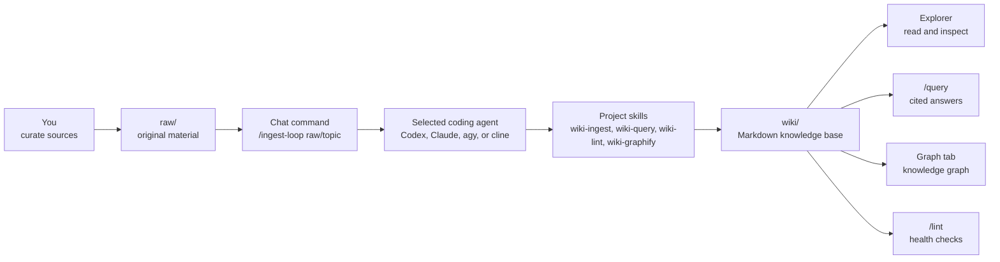

<p align="center">
  
</p>

<h1 align="center">CLIO</h1>

<p align="center">
  <strong>A local-first LLM Wiki workbench.</strong><br>
  Drop sources in <code>raw/</code>, let a coding agent compile them into a durable,
  interlinked Markdown wiki you own — readable, searchable, graphable, and version-controlled.
</p>

<p align="center">
  <a href="LICENSE"></a>
  
  
  
</p>

---

## The idea

Most "chat with your documents" tools are RAG: you upload files, and the LLM
rediscovers the relevant chunks *from scratch on every question*. Nothing
accumulates. Ask something that spans five documents and the model re-pieces
the answer every time.

CLIO is built on Andrej Karpathy's [LLM Wiki pattern](./llm-wiki.md): instead of
retrieving raw chunks at query time, an agent **incrementally compiles a
persistent wiki** that sits between you and your sources. Add a source and the
agent reads it, extracts what matters, updates the relevant entity and concept
pages, cross-links them, and flags contradictions. The knowledge is compiled
once and then *kept current* — not re-derived per query.

The result is not a transcript and not an opaque vector store. It is a folder of
plain Markdown files you can read in any editor, grep, diff, commit, and trust.

> **You curate, the agent maintains.** You decide what goes in `raw/` and what
> questions matter. The agent does the summarizing, filing, cross-referencing,
> linting, and graph-building.

## What you actually get

Run one ingest over two short articles and a small code module, and the wiki
fills itself in:

```text
wiki/
├── sources/                      # one evidence card per original source
│   ├── articles/
│   │   ├── leaf-first-merge.md   #   ← summary of raw/articles/leaf-first-merge.md
│   │   └── raw-immutability.md
│   ├── code/throttle/index.md    #   ← directory-level summary of a code+image leaf
│   └── index.md                  #   ← generated source catalog (facets, dates)
├── concepts/                     # the synthesis layer, cross-linked to sources
│   ├── leaf-first-merge-pass.md
│   ├── raw-immutability.md
│   └── sliding-window-rate-limit.md
├── graph/                        # graphify-backed knowledge graph (graph.json, report)
├── index.md                      # category catalog
└── log.md                        # append-only operation history
```

Want to see real output before installing anything? Browse
[`examples/mini-wiki/`](./examples/mini-wiki/) — a complete, hand-curated
snapshot showing the exact shape of source pages, concept pages, the generated
catalog, and the log.

## Why developers might care

| | |
|---|---|
| **Plain files, no lock-in** | Every artifact is Markdown or JSON under `wiki/`. Read it, grep it, commit it, throw it in Obsidian. |
| **Your sources stay immutable** | Originals live in `raw/` and agents treat them as read-only evidence — never rewritten behind your back. |
| **Bring your own agent** | Works with `codex`, `claude`, `agy` (Antigravity), or `cline`. CLIO orchestrates; the CLI you trust does the reasoning. |
| **Code Wiki** | Point it at a repo and get a graphify knowledge graph of the codebase under `wiki/graph/`, bridged to the prose wiki. |
| **Incremental & resumable** | Big folders are processed leaf-first in small chunks and merged. Interrupted runs resume from saved progress. |
| **Browser + CLI + Telegram** | A Next.js UI (Chat, Explorer, Graph, Automations, Settings), a native `clio` CLI, and a `/query` Telegram bot. |
| **Reviewable automation** | Auto Ingest, Auto Lint, and draft-only scheduled jobs keep the wiki moving without hiding what they did. |

## How it works



The contract is ownership. You own `raw/`; the agent owns `wiki/`:

| Path | Owner | Purpose |
|---|---|---|
| `raw/` | You | Original sources. Immutable to agents except through explicit preprocess. |
| `raw/chat/`, `raw/automation/` | You / Automations | Append-only capture and draft job records, ready for later ingest. |
| `wiki/sources/<raw-path>.md` | Agent | One source summary per original, mirroring the `raw/` path. |
| `wiki/` (concepts, answers, lint, graph) | Agent | The generated, maintained knowledge base. |
| `.agents/skills/` | Project | The skills that define every CLIO operation. |
| `webapp/`, `cli-rs/` | Project | Next.js UI and the native `clio` CLI. |

## Quick start

Install the latest release into `~/.clio`, run setup, and start the web app:

```bash
curl -fsSL https://raw.githubusercontent.com/hjhun/llm-wiki/main/scripts/install.sh | bash -s -- --start
cd ~/.clio
```

Then open:

```text
http://127.0.0.1:9091
```

On first visit, CLIO redirects to `/setup`. Set an administrator password, log
in, then open **Settings** and choose your default coding agent CLI.

> CLIO binds to `0.0.0.0` by default so other machines on a trusted LAN can
> reach `http://<server-ip>:9091`. For local-only, install with
> `./setup.sh --host 127.0.0.1 --start`.

**Prerequisites:** `bash`, `tar`, and `curl`/`wget` for the installer; then
Node.js `>=20`, npm, Python 3, and at least one supported agent CLI (`codex`,
`claude`, `agy`, or `cline`). A Rust toolchain is optional — releases ship a
prebuilt `clio` binary and fall back to `cargo build` only when needed.
`graphify` and `qmd` install by default; Marp and `agent-browser` are optional.

## Your first wiki in five minutes

```bash
mkdir -p raw/demo
cp examples/raw/llm-wiki-demo.md raw/demo/
```

In the **Chat** tab:

```text
/ingest-loop raw/demo
/query Why is the leaf-first merge pass necessary in LLM Wiki?
```

You should see a source summary appear under `wiki/sources/`, related
concept/entity pages created or updated, `wiki/index.md` and `wiki/log.md`
refreshed, and a query answer that cites the wiki pages it used.

Full walkthrough: [docs/GUIDE.md](./docs/GUIDE.md) · 한국어 안내서:
[docs/GUIDE_ko.md](./docs/GUIDE_ko.md).

## Core workflows

Run these from the **Chat** tab, the `clio` CLI, or the Telegram bot:

| Command | Use it for |
|---|---|
| `/ingest raw/<path>` | Process one ingest sub-chunk, then stop — careful manual stepping. |
| `/ingest-loop raw/<path>` | Keep ingesting until the folder is complete. Retries transient failures and resumes from saved progress. Recommended. |
| `/ingest-loop` | Incrementally ingest all of `raw/`. |
| `/query <question>` | Answer from the wiki first, with citations. |
| `/lint` / `/lint --fix` | Check metadata, links, contradictions, and consistency; `--fix` applies safe fixes and writes a report. |
| `/preprocess raw/<path> <rules>` | Dry-run cleanup planning for noise under `raw/`; only `--apply` mutates files (after backups). |

## Code Wiki

Put a repo snapshot (or an approved symlink) under `raw/` and run the normal
ingest flow:

```text
/ingest-loop raw/repos/<project>
```

The agent auto-detects code-heavy leaves, writes `wiki/sources/` provenance
summaries, then relies on `wiki-graphify update` to materialize source-code
structure as a knowledge graph under `wiki/graph/` (`graph.json`,
`GRAPH_REPORT.md`, per-project parts). Code stays read-only evidence — actual
code edits are separate tasks, never ingest work. Graph nodes bridge back to the
prose wiki where code implements a documented concept.

Run **Build** / **Incremental Update** from the **Graph** tab. The web app never
calls `graphify` directly; the selected agent reads the `wiki-graphify` skill and
runs the global `graphify` command (or `python3 -m graphify`).

## Command-line interface

`setup.sh` installs a native Rust CLI at `<install-dir>/bin/clio` that runs the
same operations as the Chat tab, so you can drive a wiki from a terminal or
script:

```bash
export PATH="$HOME/.clio/bin:$PATH"

clio raw add ./notes/          # copy material into raw/ (--symlink to link instead)
clio ingest-loop raw/notes     # process it through the configured agent
clio query "What changed?"     # ask the wiki
clio lint --fix                # health check + safe fixes
clio status                    # project, webapp URL, token status
```

`ingest`, `ingest-loop`, `query`, and `lint` call the **running webapp's HTTP
API**, so they behave exactly like the Chat tab — start the webapp first. `raw`
subcommands work offline. `start` / `shutdown` / `restart` manage the server via
`clio-web.service` when installed, otherwise via `setup.sh`. The CLI finds its
project via `$CLIO_HOME`, then by walking up from the current directory, then
`~/.clio`.

## Web UI

| Tab | Purpose |
|---|---|
| **Chat** | Run `/ingest`, `/query`, `/lint`, `/preprocess`, or natural-language requests. |
| **Explorer** | Browse `raw/`, `wiki/`, and generated reports. |
| **Graph** | Build, update, and inspect the Cytoscape knowledge graph. |
| **Automations** | Schedule draft-only multi-CLI jobs; inspect runs under `raw/automation/`. |
| **Settings** | Agent CLI, host/port, graph behavior, Auto Ingest/Lint, language, theme, password. |

CLIO ships a bilingual Korean/English UI. The `/query` flow is also available
through a Telegram bot — set the token under **Settings → Telegram**, pick
polling or webhook delivery, approve chat ids, and ask from your phone. See
[docs/GUIDE.md §15](./docs/GUIDE.md#15-telegram-bot).

## Adding your own sources

`raw/` is the only place to put original material. A useful layout:

```text
raw/
├── articles/2026-05-llm-wiki/karpathy-llm-wiki.md
├── papers/retrieval/paper.pdf
├── meetings/2026-05-17-kickoff.md
├── repos/my-service/          # copied repo or approved symlink
└── web-clips/graphify.md
```

- Group related files in the same leaf folder so they get summarized together.
- Never put secrets, API keys, or unnecessary personal data in `raw/`.
- OCR scanned PDFs/images first, or add a companion `.md` note.
- Then run `/ingest-loop raw/<folder>`, enable Auto Ingest, or use
  `clio raw add` + `clio ingest-loop` from a terminal.

## Supported agent CLIs

| CLI | Invocation shape |
|---|---|
| `codex` | `codex exec "<prompt>"` |
| `claude` | `claude -p "<prompt>"` |
| `agy` (Antigravity) | `agy --prompt "<prompt>"` |
| `cline` | `cline -y "<prompt>"` |

Each CLI must be authenticated in the environment where the web app runs. If
Chat or Graph reports no default agent, choose one in Settings. A Graph request
asking for an API key usually means the selected CLI is not logged in, or the
webapp was started without the CLI's normal environment.

<details>
<summary><strong>Installation & setup options</strong></summary>

The release installer downloads a GitHub source tarball, then runs `setup.sh`.
It defaults to `~/.clio`; pass `--dir <path>` (or set `CLIO_INSTALL_DIR`) to
install elsewhere. Re-installing refreshes project files while preserving
`raw/`, `wiki/`, `sessions/`, `config/local.json`, `.run/`, and
`webapp/node_modules|.next|.env*`.

```bash
# custom dir, skip graphify, custom port, then start
curl -fsSL https://raw.githubusercontent.com/hjhun/llm-wiki/main/scripts/install.sh \
  | bash -s -- --dir ./my-clio --skip-graphify --port 7788 --start

# update an existing install without touching raw/ or wiki/
curl -fsSL https://raw.githubusercontent.com/hjhun/llm-wiki/main/scripts/install.sh \
  | bash -s -- update --dir ./my-clio --skip-build

# pin a specific release
curl -fsSL .../install.sh | bash -s -- --version v0.1.0
```

**Installer options:** `install` (default) · `update`/`upgrade` ·
`--dir <path>` · `--version <ver>` · `--ref <ref>` · `--repo <owner/name>` ·
`--no-setup`. Any other args pass through to `setup.sh`.

**`setup.sh` options** (`./setup.sh --help` for all): `--start` · `--shutdown` ·
`--port <n>` · `--host <addr>` · `--dev` · `--skip-graphify` ·
`--skip-bubblewrap` · `--skip-npm-install` · `--skip-build` · `--skip-cli` ·
`--skip-qmd` · `--with-marp` · `--with-agent-browser` ·
`--install-cli=<codex|claude|agy|cline>`.

**Global skill.** `setup.sh` installs the `clio` agent skill to
`~/.agents/skills/clio` by default, letting compatible agents use CLIO as
project memory from other repos. Change the target with `--clio-skill
global|project|both|none`.

Runtime files land in `.run/webapp.pid` and `.run/webapp.log`.

</details>

<details>
<summary><strong>Run on boot with systemd</strong></summary>

On systemd hosts (Ubuntu 22.04/24.04, etc.):

```bash
./systemd/install-clio-web-service.sh
```

This renders `systemd/clio-web.service` for the current checkout and user,
installs the unit into `/etc/systemd/system` (use `--unit-dir vendor` for the
vendor directory), reloads systemd, enables it for `multi-user.target`, and
restarts it. It uses `sudo` only for the install/start steps.

```bash
sudo systemctl status clio-web.service
sudo journalctl -u clio-web.service -f
sudo systemctl restart clio-web.service
```

</details>

<details>
<summary><strong>Public sharing &amp; sandboxed CLI login</strong></summary>

Admins can enable a passwordless, read-only public chat at `/clio` from
**Settings → Access → Public Query**. Public CLIO never exposes `raw/`, `wiki/`,
`sessions/`, `config/local.json`, or `.env*` to visitors. The server selects
small wiki excerpts, then runs the agent CLI inside a `bubblewrap` sandbox with a
dedicated home at `config/public-cli-home/`. `setup.sh` installs `bwrap` on Linux
when it can; without it, public CLIO falls back to safe read-only responses.

The sandbox uses a writable HOME and overlays selected host agent config paths
read-only (login, MCP, plugin, skill state) without modifying host files. The
default `publicQuery.sandboxReadOnlyHomePaths` allowlist covers `.codex`,
`.claude`, `.cline`, `.agy`, `.antigravity`, `.agents`, and their
`.config/.local/.cache` variants; override it in `config/local.json` as needed.
Snap-packaged CLIs cannot run in this unprivileged sandbox — install those via
npm or a standalone binary.

To keep host login state private, remove the relevant allowlist entries and log
in once using the dedicated home:

```bash
cd ~/.clio
mkdir -p config/public-cli-home && chmod 700 config/public-cli-home
HOME="$PWD/config/public-cli-home" codex login
```

The full `bwrap` login-shell recipe (closest match to runtime isolation) lives
in [docs/GUIDE.md](./docs/GUIDE.md). The public CLI home may hold credentials, so
it is git-ignored — treat it like `config/local.json`.

</details>

## Development

```bash
git clone https://github.com/hjhun/llm-wiki.git
cd llm-wiki
./setup.sh

./setup.sh --start --dev --skip-build   # dev server
cd webapp && npm run typecheck && npm run build
./scripts/smoke-test.sh                 # smoke test
```

**Releases:** add notes under `docs/releases/vX.Y.Z.md`, then **Actions → Release
→ Run workflow** with a tag like `v0.2.0`. The workflow validates scripts, bumps
`webapp/package.json` to the release version, tags, and publishes the GitHub
Release.

```text
.
├── .agents/skills/   # project-local agent skills (CLIO operations)
├── cli-rs/           # native Rust `clio` CLI source
├── config/           # default + local configuration
├── docs/             # user guides, QA notes, release notes
├── examples/         # sample sources + mini-wiki snapshot
├── raw/              # user-owned source material
├── scripts/          # installer and utilities
├── webapp/           # Next.js web application
└── wiki/             # agent-maintained Markdown wiki
```

## Project status

CLIO is a usable local-first workbench: authenticated setup/login, a bilingual
UI, Chat with external captures, Explorer, Cytoscape graph, ingest/query/lint,
the native `clio` CLI, Auto Ingest/Lint, draft-only Automations, a Telegram bot,
release/update scripts, and optional systemd install are all implemented. The
agent skills, graph schema, automation templates, and setup ergonomics are
active interfaces that may still change between releases.

## Security notes

- The administrator password is the only built-in authentication layer.
- The default host `0.0.0.0` is LAN-reachable — use `127.0.0.1` on untrusted
  networks.
- `config/local.json`, sessions, runtime logs, CLI detection, and graph state
  are git-ignored by default.
- Agents treat `raw/` as immutable. Do not store credentials, API keys, or
  sensitive personal data in `raw/` or `wiki/`.

## References

- [Andrej Karpathy, `llm-wiki.md`](https://gist.github.com/karpathy/442a6bf555914893e9891c11519de94f) — the original LLM Wiki pattern.
- [safishamsi/graphify](https://github.com/safishamsi/graphify) — knowledge graph generation behind CLIO's graph workflow.
- [docs/GUIDE.md](./docs/GUIDE.md) / [docs/GUIDE_ko.md](./docs/GUIDE_ko.md) — complete user guides.
- [AGENTS.md](./AGENTS.md) / [CLAUDE.md](./CLAUDE.md) — operating rules for coding agents.
- [docs/IDEATION.md](./docs/IDEATION.md) — product and architecture notes.

## License

Licensed under the Apache License 2.0. See [LICENSE](./LICENSE).
