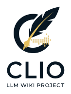
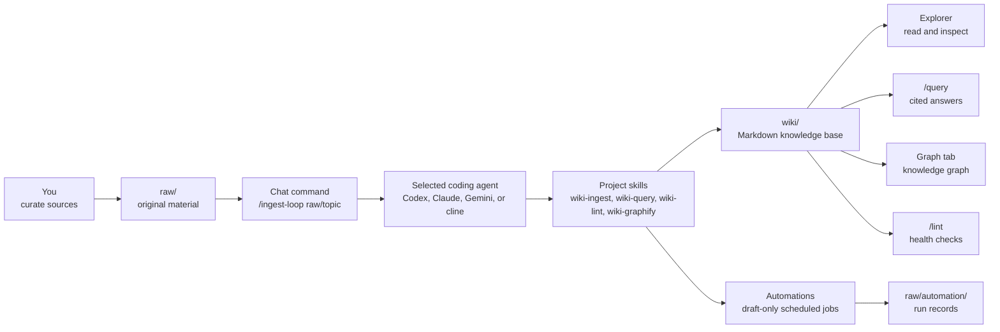

<p align="center">
  
</p>

# CLIO

**CLIO is a local-first LLM Wiki and Code Wiki workbench.** Put source material or source code in `raw/`, ask a coding agent to ingest it, and grow a durable Markdown wiki in `wiki/` that you can read, search, lint, graph, and improve over time.

CLIO packages Andrej Karpathy's LLM Wiki pattern into a runnable local project. The user stays in the curator role: you collect source material, decide what matters, and ask questions. The agent does the maintenance work: summarizing sources, creating concept/entity pages, updating indexes, recording logs, checking wiki health, and building graph artifacts.

## Why CLIO?

Most "chat with your documents" tools hide knowledge in a transcript or an opaque vector store. CLIO keeps the useful result in ordinary Markdown files.

| Capability | What it means |
|---|---|
| Local-first source library | Your original material lives in `raw/`; agents treat it as read-only. |
| Maintained Markdown wiki | Summaries, concepts, entities, answers, lint reports, and graph reports live in `wiki/`. |
| Code Wiki | Code under `raw/` can become module, API, architecture, testing, and debug pages under `wiki/code/`. |
| Agent-operated workflows | `codex`, `claude`, `gemini`, or `cline` can run `/ingest`, `/query`, `/lint`, preprocess, and graph workflows. |
| Browser workbench | A Next.js UI provides Chat, Explorer, Graph, Automations, and Settings tabs. |
| Incremental processing | Large folders are processed leaf-first in small chunks, then merged into a coherent wiki. |
| Automation support | Auto Ingest, Auto Lint, and draft-only scheduled jobs help keep the wiki moving without hiding the artifacts. |
| Reviewable outputs | Wiki pages, logs, sessions, and graph JSON are files you can inspect and version. |

## How It Works



The important split is ownership:

| Path | Owner | Purpose |
|---|---|---|
| `raw/` | You | Original source files. Agents treat them as immutable except through explicit preprocess or user-driven file operations. |
| `raw/chat/` | You via Chat | User-approved external captures from Chat, such as browser/search/tool findings, ready for later ingest. |
| `raw/automation/` | Automations | Draft-only scheduled job records. Treat them as source candidates for later ingest. |
| `wiki/` | Agent | Generated and maintained Markdown wiki. |
| `wiki/sources/YYYY/YYYY-MM/` | Agent | One source summary page per original source. |
| `wiki/answers/` | Agent | Saved answers from query workflows. |
| `wiki/lint/` | Agent | Wiki health reports. |
| `wiki/graph/` | Agent + graphify | Graph JSON, graph report, partial graph state. |
| `sessions/` | System | Chat and CLI session records. |
| `.agents/skills/` | Project | Local instructions that define CLIO operations. |
| `webapp/` | Project | Next.js browser UI. |

## Quick Start

Install the latest GitHub release into `~/.clio`, run setup, and start the web app:

```bash
curl -fsSL https://raw.githubusercontent.com/hjhun/llm-wiki/main/scripts/install.sh | bash -s -- --start
cd ~/.clio
```

The installer defaults to `~/.clio`. Pass `--dir <path>` (or set `CLIO_INSTALL_DIR`)
to install somewhere else. If the target already contains CLIO, `install`
refreshes project files while preserving `raw/`, `wiki/`, `sessions/`,
`config/local.json`, `.run/`, `webapp/node_modules/`, `webapp/.next/`, and
`webapp/.env*`.

`setup.sh` installs the `clio` agent skill globally by default. The release
installer runs `setup.sh`, so the quick-start command installs it too:

```text
~/.agents/skills/clio
```

This lets compatible coding agents use CLIO as local project memory from other
repositories. Change the skill target with `--clio-skill` on either
`scripts/install.sh` or `setup.sh`:

```bash
bash scripts/install.sh --clio-skill global   # default
bash scripts/install.sh --clio-skill project  # <install-dir>/.agents/skills/clio
bash scripts/install.sh --clio-skill both
bash scripts/install.sh --clio-skill none

./setup.sh --clio-skill both
```

The global skill requires the agent runtime to include `~/.agents/skills` in its
skill search path. CLIO-compatible launchers are expected to do this.

Open:

```text
http://127.0.0.1:9091
```

On the first visit, CLIO redirects to `/setup`. Set the administrator password, log in, then open **Settings** and choose the default coding agent CLI.

CLIO binds to `0.0.0.0` by default, so machines on the same trusted LAN can connect at `http://<server-ip>:9091`. To restrict the server to this machine:

```bash
./setup.sh --host 127.0.0.1 --start
```

## Prerequisites

The release installer needs:

- `bash`
- `tar`
- `curl` or `wget`

The project setup and full workflows need:

- Node.js `>=20`
- npm
- Python 3
- At least one supported coding agent CLI: `codex`, `claude`, `gemini`, or `cline`
- Optional: a Rust toolchain (`cargo`) to build the `clio` CLI from source.
  Release installs try the prebuilt `clio` asset for Ubuntu, Windows, or macOS
  first, then fall back to a local cargo build when no matching asset exists.
- Optional: `graphify`, `qmd`, and Marp CLI
- Optional: `agent-browser` for browser-based automation jobs

`setup.sh` detects installed agent CLIs and writes the result to `config/cli-detected.json`. Missing CLIs can be installed manually or configured by path in Settings.

## Current State

The current app is a working local-first workbench rather than a thin prototype. The implemented surfaces include authenticated setup/login, a bilingual Korean/English UI, Chat sessions with append-only external captures under `raw/chat/`, Explorer browsing for `raw/`, `wiki/`, and `sessions/` with file operations where allowed, Cytoscape graph inspection, Auto Ingest, Auto Lint, draft-only Automations, the native `clio` CLI, release/update scripts, and optional systemd service installation.

The project is still evolving. The agent skills, graph schema, automation templates, and setup ergonomics should be treated as active interfaces that may change between releases.

## First Wiki in Five Minutes

Copy the sample source into `raw/`:

```bash
mkdir -p raw/demo
cp examples/raw/llm-wiki-demo.md raw/demo/
```

In the **Chat** tab, run:

```text
/ingest-loop raw/demo
```

Then ask:

```text
/query Why is the leaf-first merge pass necessary in LLM Wiki?
```

Expected result:

- A source summary appears under `wiki/sources/YYYY/YYYY-MM/`.
- Related concept/entity pages may be created or updated.
- `wiki/index.md` and `wiki/log.md` are updated.
- The query answer cites wiki/source pages.

For a full walkthrough, read [docs/GUIDE.md](./docs/GUIDE.md). 한국어 안내서는 [docs/GUIDE_ko.md](./docs/GUIDE_ko.md)를 참고하세요.

## Core Workflows

Run these from the **Chat** tab:

| Command | Use it for |
|---|---|
| `/ingest raw/<path>` | Process one ingest sub-chunk, then stop. Useful for careful manual stepping. |
| `/ingest-loop raw/<path>` | Keep invoking ingest until the selected folder is complete. Transient CLI failures are retried and resume from saved progress. Recommended for normal use. |
| `/ingest-loop` | Incrementally ingest all of `raw/`. |
| `/query <question>` | Answer from the wiki first, with citations. |
| `/lint` | Check metadata, links, contradictions, index consistency, and sensitive information. |
| `/lint --fix` | Apply safe automatic fixes and write a lint report. |
| `/preprocess raw/<path> <rules>` | Dry-run cleanup planning for noise under `raw/`; only `/preprocess --apply` mutates files after backups. |

## Code Wiki

CLIO can document software projects as part of the same local-first knowledge
base. Put a repository snapshot or an approved symlink under `raw/`, then run
the normal ingest flow:

```text
/ingest-loop raw/repos/<project>
```

The selected coding agent auto-detects code-heavy leaves, reads the
project-local Code Wiki helper skills, and writes graph-ready Markdown under
`wiki/code/<project>/`: project overviews, module pages, API/CLI notes,
architecture synthesis, testing notes, debug notes when logs or failures are
present, Mermaid diagrams for structure/dependencies, and an OpenGrok-like
`locations.md` index with symbol, file, and line references. The deterministic
helper `scripts/code-index.mjs` extracts symbols, import edges, line numbers,
and Mermaid drafts for agents to use during ingest. Code sources remain
read-only evidence under `raw/`; actual code edits are separate coding tasks,
not ingest work.

Code Wiki pages are linked from `wiki/index.md` under `Code` and can be included
in `wiki-graphify update`, so questions can bridge prose knowledge and
implementation details.

Run graph workflows from the **Graph** tab:

| Button | What happens |
|---|---|
| Build | Requests `wiki-graphify build` through the selected coding agent. |
| Incremental Update | Requests `wiki-graphify update` through the selected coding agent. |

The web app does not execute `graphify` directly. The selected coding agent reads the `wiki-graphify` skill and uses the global `graphify` command from `PATH`, or `python3 -m graphify` when appropriate.

## Command-Line Interface (`clio`)

`setup.sh` installs a native Rust CLI to `<install-dir>/bin/clio`. Release
installs use a prebuilt binary when one is available for the current OS and CPU;
source checkouts fall back to `cargo build --release`. The CLI runs the same
operations as the Chat tab, so you can drive a wiki from a terminal or a script.

Add it to your `PATH` (the installer prints this line when needed):

```bash
export PATH="$HOME/.clio/bin:$PATH"
```

| Command | What it does |
|---|---|
| `clio raw add <path>...` | Copy files or folders into `raw/`. Use `--symlink` to add links instead of copying bytes. Re-adding an existing path replaces it and moves the previous entry to `raw/.trash/`. |
| `clio raw remove <raw-path>...` | Soft-delete a file from `raw/` (moves it to `raw/.trash/`). |
| `clio raw list [raw-path]` | List files currently under `raw/`. |
| `clio ingest [path]` | Run one `/ingest` pass through the configured coding agent. |
| `clio ingest-loop [path]` | Run `/ingest-loop [path]` until the progress state is drained. |
| `clio query <question>` | Ask the wiki a question. |
| `clio lint [--fix]` | Run the wiki-lint health check. |
| `clio status` | Show the resolved project, webapp URL, and token status. |

`ingest`, `ingest-loop`, `query`, and `lint` call the **running webapp's HTTP
API**, so they behave exactly like the Chat tab — same coding agent, same
ingest-loop orchestration, same session logs. Start the webapp first
(`./setup.sh --start`). `raw` subcommands work offline; they only touch the
filesystem.

The CLI finds its project by checking `$CLIO_HOME`, then `~/.clio`, then
walking up from the current directory. It reads the webapp port and the
`auth.cliToken` from `config/local.json`. Override any of these with
`--home`, `--base-url`, or `--token` (or the matching `CLIO_*` env vars).

## Adding Your Own Raw Data

`raw/` is the only place you should put original material.

Recommended layout:

```text
raw/
├── articles/
│   └── 2026-05-llm-wiki/
│       ├── karpathy-llm-wiki.md
│       └── notes.md
├── papers/
│   └── retrieval/
│       └── paper.pdf
├── meetings/
│   └── 2026-05-17-project-kickoff.md
├── repos/
│   └── my-service/              # copied repo or approved symlink
│       ├── package.json
│       └── src/
└── web-clips/
    └── graphify-readme.md
```

Tips:

- Prefer clear folder names by topic, project, date, author, or source type.
- Put related files in the same leaf folder so CLIO can summarize them together.
- Do not put secrets, API keys, private tokens, or unnecessary personal data into `raw/`.
- If a PDF or image is scanned and has no selectable text, OCR it first or add a companion `.md` note.
- After adding files, run `/ingest-loop raw/<folder>` or enable Auto Ingest in Settings.
- From a terminal, `clio raw add <file>` copies material in; `clio raw add --symlink <folder>` links an external folder; `clio ingest-loop` processes it.

## Web UI

| Tab | Purpose |
|---|---|
| Chat | Run `/ingest`, `/ingest-loop`, `/query`, `/lint`, `/preprocess`, or natural-language requests. |
| Explorer | Browse `raw/`, `wiki/`, and generated reports. |
| Graph | Build, update, and inspect the knowledge graph. |
| Automations | Schedule draft-only multi-CLI jobs and inspect their run records under `raw/automation/`. |
| Settings | Configure agent CLI, server host/port, graph behavior, Auto Ingest, Auto Lint, language, theme, default tab, and password. |

## Public CLIO Sharing and Sandboxed CLI Login

Administrators can enable a passwordless, read-only public chat at `/clio`
from **Settings > Access > Public Query**. Public CLIO never exposes `raw/`,
`wiki/`, `sessions/`, `config/local.json`, or `.env*` directly to visitors.
The server selects small wiki excerpts when needed, then runs the selected
agent CLI inside a `bubblewrap` sandbox with a dedicated CLI home:

```text
config/public-cli-home/
```

`setup.sh` installs `bubblewrap` (`bwrap`) on Linux when it can. If your host
does not have `bwrap`, public CLIO falls back to safe read-only responses
instead of running the host CLI outside the sandbox.

The public sandbox does not use your normal `~/.codex`, `~/.claude`, or other
personal CLI login state. Log in once using the dedicated public CLI home:

```bash
cd ~/.clio
mkdir -p config/public-cli-home
chmod 700 config/public-cli-home
HOME="$PWD/config/public-cli-home" codex login
```

For the closest match to the runtime isolation, enter a `bubblewrap` shell and
log in from there. This example prepares a Codex login shell; replace
`CLI=codex` with another configured CLI when needed:

```bash
cd ~/.clio
CLI=codex
PUBLIC_HOME="$PWD/config/public-cli-home"
WORKDIR="$(mktemp -d)"
CLI_BIN="$(command -v "$CLI")"
CLI_REAL="$(readlink -f "$CLI_BIN")"
RESOLV_CONF_REAL="$(readlink -f /etc/resolv.conf)"
CLI_BIN_DIR="$(dirname "$CLI_BIN")"
CLI_ROOT="$(node -e '
const path = require("node:path");
const real = process.argv[1];
const parts = real.split(path.sep);
const i = parts.lastIndexOf("node_modules");
if (i >= 0) {
  const end = parts[i + 1]?.startsWith("@") ? i + 3 : i + 2;
  console.log(parts.slice(0, end).join(path.sep));
} else {
  console.log(path.dirname(real));
}
' "$CLI_REAL")"

mkdir -p "$PUBLIC_HOME"
chmod 700 "$PUBLIC_HOME"

bwrap \
  --die-with-parent \
  --unshare-pid \
  --unshare-ipc \
  --unshare-uts \
  --proc /proc \
  --dev /dev \
  --tmpfs /tmp \
  --tmpfs /run \
  --dir /home \
  --bind "$PUBLIC_HOME" "$HOME" \
  --ro-bind /usr /usr \
  --ro-bind /bin /bin \
  --ro-bind /lib /lib \
  --ro-bind /lib64 /lib64 \
  --ro-bind /etc /etc \
  --dir "$(dirname "$RESOLV_CONF_REAL")" \
  --ro-bind "$RESOLV_CONF_REAL" "$RESOLV_CONF_REAL" \
  --ro-bind "$CLI_BIN_DIR" "$CLI_BIN_DIR" \
  --ro-bind "$CLI_ROOT" "$CLI_ROOT" \
  --bind "$WORKDIR" "$WORKDIR" \
  --chdir "$WORKDIR" \
  --clearenv \
  --setenv HOME "$HOME" \
  --setenv PATH "$PATH" \
  --setenv NODE_ENV production \
  /usr/bin/env bash --noprofile --norc
```

Inside that shell, run the CLI login command:

```bash
codex login
```

Then verify that public CLIO can use the same sandboxed home:

```bash
codex exec --skip-git-repo-check "Reply with OK only."
```

The dedicated public CLI home may contain credentials or refresh tokens, so it
is ignored by git. Treat it like `config/local.json`: keep it local, back it up
only through your own secret-management process, and rotate credentials if the
machine is shared more broadly than intended.

## Setup Options

The release installer downloads a GitHub source tarball and then runs `setup.sh`.

```bash
curl -fsSL https://raw.githubusercontent.com/hjhun/llm-wiki/main/scripts/install.sh | bash -s -- --dir ./my-clio --skip-graphify --port 7788 --start
```

To update an existing install without touching `raw/` or `wiki/` data:

```bash
curl -fsSL https://raw.githubusercontent.com/hjhun/llm-wiki/main/scripts/install.sh | bash -s -- update --dir ./my-clio --skip-build
```

From inside the installed CLIO directory, `--dir` is optional:

```bash
bash scripts/install.sh update --skip-build
```

Installer options:

| Option | Description |
|---|---|
| `install` | Default command. Create a new install directory, or refresh project files when the target already contains CLIO. |
| `update`, `upgrade` | Update an existing install from the selected release/ref. Preserves `raw/`, `wiki/`, `sessions/`, `config/local.json`, `.run/`, `webapp/node_modules/`, `webapp/.next/`, and `webapp/.env*`. |
| `--dir <path>` | Install directory. Default: `~/.clio`. Existing CLIO directories are refreshed with user data preserved. |
| `--version <ver>` | GitHub release tag to install, or `latest`. Default: `latest`. |
| `--ref <ref>` | GitHub tag, branch, or commit to install exactly. Overrides `--version`. |
| `--repo <repo>` | GitHub repo as `owner/name` or a `github.com` URL. Default: `hjhun/llm-wiki`. |
| `--no-setup` | Download and unpack only. |

Any other arguments are passed to `setup.sh`.

To install a specific release:

```bash
curl -fsSL https://raw.githubusercontent.com/hjhun/llm-wiki/main/scripts/install.sh | bash -s -- --version v0.1.0
```

Inside an installed or cloned checkout:

```bash
./setup.sh --help
```

Common `setup.sh` options:

| Option | Description |
|---|---|
| `--start` | Start the web server in the background after setup. |
| `--shutdown` | Stop the running CLIO web server. |
| `--no-restart` | With `--start`, fail if the target port is already in use. |
| `--port <n>` | Web UI port. Default: `9091`. |
| `--host <addr>` | Web UI host. Default: `0.0.0.0`. Use `127.0.0.1` for local-only. |
| `--dev` | Use the development server command. |
| `--skip-graphify` | Do not install or upgrade graphify. |
| `--skip-bubblewrap` | Do not install `bubblewrap`; public CLI sandboxing will require a manual install. |
| `--skip-npm-install` | Skip `webapp/` dependency checks and installation. |
| `--skip-build` | Skip `npm run build`. |
| `--skip-cli` | Skip building the Rust `clio` CLI. |
| `--with-qmd` | Best-effort optional qmd setup. |
| `--with-marp` | Best-effort optional Marp CLI setup. |
| `--with-agent-browser` | Best-effort optional agent-browser setup for browser automation tasks. |
| `--install-cli=<names>` | Best-effort CLI install for `codex`, `claude`, `gemini`, or `cline`. |

Runtime files are written under `.run/`:

```text
.run/webapp.pid
.run/webapp.log
```

## Start on Boot with systemd

On Ubuntu 22.04/24.04 or similar systemd hosts, install the web UI as a system service:

```bash
./systemd/install-clio-web-service.sh
```

The script prepares the web app, renders `systemd/clio-web.service` for the current checkout path and user, installs the unit, runs `systemctl daemon-reload`, enables it for `multi-user.target`, and restarts it. It uses `sudo` only for the systemd install/start steps, so Ubuntu will prompt for your password when needed.

By default the unit is installed into `/etc/systemd/system`, which is the safest local-administrator location. If you intentionally want the Ubuntu vendor-style unit directory, use:

```bash
./systemd/install-clio-web-service.sh --unit-dir vendor
```

On current Ubuntu releases, `vendor` selects `/usr/lib/systemd/system` when present and falls back to `/lib/systemd/system`. In both cases `systemctl enable clio-web.service` creates the appropriate `multi-user.target.wants/` symlink.

Useful commands:

```bash
sudo systemctl status clio-web.service
sudo journalctl -u clio-web.service -f
sudo systemctl restart clio-web.service
sudo systemctl disable --now clio-web.service
```

## Supported Agent CLIs

| CLI | Invocation shape |
|---|---|
| `codex` | `codex exec "<prompt>"` |
| `claude` | `claude -p "<prompt>"` |
| `gemini` | `gemini --prompt "<prompt>"` |
| `cline` | `cline -y "<prompt>"` |

Each CLI must be authenticated in the host environment where the web app runs. If Chat or Graph says that no default agent is configured, open Settings and choose one. If a Graph Build/Update request asks for an API key, it usually means the selected coding agent CLI is not logged in or the webapp process was started without the CLI's normal environment.

## Development

Clone and set up:

```bash
git clone https://github.com/hjhun/llm-wiki.git
cd llm-wiki
./setup.sh
```

Start development mode:

```bash
./setup.sh --start --dev --skip-build
```

Typecheck and build:

```bash
cd webapp
npm run typecheck
npm run build
```

Smoke test:

```bash
./scripts/smoke-test.sh
```

Create a GitHub release:

1. Add release notes under `docs/releases/vX.Y.Z.md`.
2. Open **Actions** -> **Release** -> **Run workflow**.
3. Enter a version tag such as `v0.2.0`.

The workflow validates release-critical scripts, creates the Git tag, and creates
the GitHub Release. Before tagging, it also updates `webapp/package.json` and
`webapp/package-lock.json` to the release version, so the installed web UI shows
the same version as the GitHub release. `scripts/install.sh` installs that
release when it is the latest release, or when users pass `--version vX.Y.Z`.

## Project Structure

```text
.
├── .agents/skills/       # Project-local agent skills
├── .github/workflows/     # GitHub Actions release automation
├── cli-rs/               # Native Rust `clio` CLI source
├── config/               # Default and local configuration
├── docs/                 # User guides, QA notes, release notes
├── examples/raw/         # Sample source material
├── raw/                  # User-owned source material
├── scripts/              # Installer and utility scripts
├── tools/                # Optional local helper tools such as qmd
├── webapp/               # Next.js web application
└── wiki/                 # Agent-maintained Markdown wiki
```

Important documents:

| Document | What's covered |
|---|---|
| [docs/GUIDE.md](./docs/GUIDE.md) | Complete English user guide. |
| [docs/GUIDE_ko.md](./docs/GUIDE_ko.md) | Complete Korean user guide. |
| [AGENTS.md](./AGENTS.md) | Repository operating rules for coding agents. |
| [CLAUDE.md](./CLAUDE.md) | Claude-side mirror of the same operating rules. |
| [docs/IDEATION.md](./docs/IDEATION.md) | Product and architecture notes. |
| [tools/README.md](./tools/README.md) | graphify, qmd, and Marp notes. |

## Security Notes

- CLIO's administrator password is the only built-in authentication layer.
- The default host is `0.0.0.0`, which is LAN-reachable. Use `127.0.0.1` on untrusted networks.
- `config/local.json`, sessions, runtime logs, local CLI detection, and generated graph state are git-ignored by default.
- `raw/` is immutable from the agent's perspective. Agents must not modify, delete, or move original sources.
- Do not store credentials, API keys, or sensitive personal data in `raw/` or `wiki/`.

## References

- [Andrej Karpathy, `llm-wiki.md`](https://gist.github.com/karpathy/442a6bf555914893e9891c11519de94f) - the original LLM Wiki pattern.
- [safishamsi/graphify](https://github.com/safishamsi/graphify) - knowledge graph generation used by CLIO's graph workflow.

## License

This project is licensed under the Apache License 2.0. See [LICENSE](./LICENSE).

## Status

CLIO is a usable local-first workbench with the main browser, CLI, ingest/query/lint, graph, automation, and setup surfaces implemented. The skills, graph schema, automation templates, and setup ergonomics are still expected to evolve.
