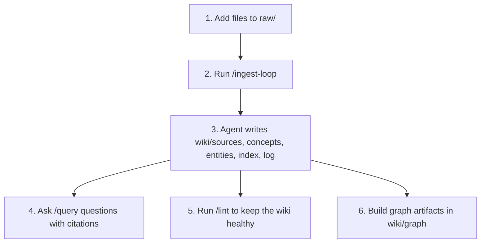
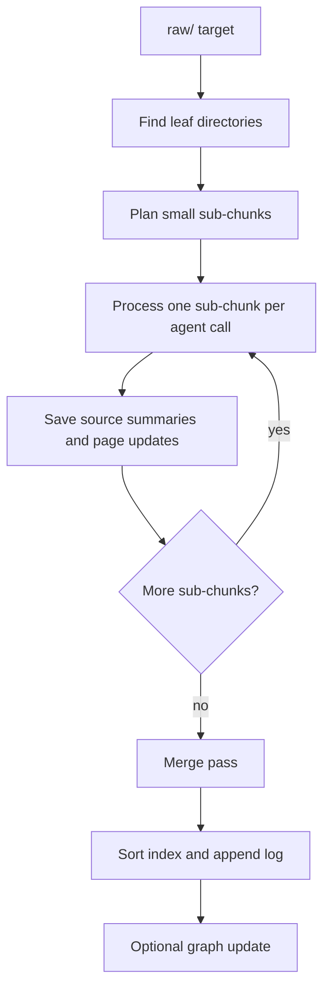

# CLIO User Guide

This guide explains how to install CLIO, start the web UI, add raw data, ingest it into a wiki, ask questions, build a graph, and run basic QA checks. It combines the old first-run and QA notes into one practical handbook.

한국어 안내서는 [GUIDE_ko.md](./GUIDE_ko.md)를 참고하세요.

## 1. What CLIO Is

CLIO is a local-first LLM Wiki workbench.

You collect source material in `raw/`. A coding agent reads that material and maintains a Markdown wiki in `wiki/`. The browser UI gives you five main tabs:

| Tab | What you do there |
|---|---|
| Chat | Run `/ingest-loop`, `/query`, `/lint`, and other agent requests. |
| Explorer | Browse and inspect source files, wiki pages, logs, and reports. |
| Graph | Build or update the knowledge graph. |
| Automations | Create scheduled multi-CLI jobs that write draft-only records under `raw/automation/`. |
| Settings | Choose the default agent CLI, configure host/port, Auto Ingest, Auto Lint, language/theme, graph options, and password. |

The core idea is simple:



CLIO is not just a chat interface over documents. The important result is the generated wiki: ordinary Markdown files that can be read, searched, reviewed, backed up, and improved.

### Current Implementation Snapshot

The current CLIO app includes authenticated first-run setup and login, Korean/English language switching, a native `clio` CLI, Chat sessions with optional external captures under `raw/chat/`, Explorer browsing plus upload/rename/delete actions where allowed, a Cytoscape-based graph view, Auto Ingest, Auto Lint, draft-only scheduled Automations, release/update scripts, and optional systemd service installation.

Some interfaces are still intentionally active areas of development: project skills, graph output shape, automation templates, and setup ergonomics may change between releases.

## 2. Mental Model

### User-Owned Source Area: `raw/`

`raw/` is where you put original material:

- notes
- Markdown files
- text files
- copied web articles
- meeting transcripts
- exported documents
- PDFs that contain selectable text
- companion notes for images, scanned PDFs, or other difficult media

Agents must treat `raw/` as read-only. They should not edit, delete, or move your original files.

Chat can also create append-only external captures under `raw/chat/` when you
explicitly save an assistant message. Use this for browser/search/tool findings
that should become source candidates. The full conversation still lives under
`sessions/`; `raw/chat/` is for curated captures, not transcript storage.

### Agent-Maintained Wiki: `wiki/`

`wiki/` is where the agent writes generated knowledge:

- `wiki/sources/<raw-relative-path>.md` - source summaries (mirroring the `raw/` path)
- `wiki/entities/` or similarly named pages - people, organizations, projects, products
- `wiki/concepts/` or similarly named pages - ideas, patterns, methods
- `wiki/answers/` - saved query answers
- `wiki/lint/` - health reports
- `wiki/graph/` - graph JSON, report, partial graph state
- `wiki/index.md` - catalog of pages
- `wiki/log.md` - append-only operation log

Do not expect the wiki to be perfect after one ingest. It improves over repeated ingest, query feedback, linting, and manual curation.

### Project Skills

The repository includes local instructions in `.agents/skills/`. These tell the selected coding agent how to operate CLIO:

| Skill | Trigger | Purpose |
|---|---|---|
| `wiki-ingest` | `/ingest`, `/ingest-loop` | Read `raw/` in chunks and maintain `wiki/`. |
| `wiki-query` | `/query`, normal questions | Answer from wiki pages and cite sources. |
| `wiki-lint` | `/lint` | Find broken links, metadata gaps, contradictions, and security issues. |
| `wiki-graphify` | Graph tab, graph requests | Build or update `wiki/graph/` artifacts. |
| `wiki-search-qmd` | Optional helper | Improve search when qmd is installed. |
| `wiki-marp` | Optional helper | Produce Marp slide answers when Marp is installed. |

## 3. Requirements

### Required for the Installer

- `bash`
- `tar`
- `curl` or `wget`

### Required for Full Operation

- Node.js `>=20`
- npm
- Python 3
- At least one supported coding agent CLI:
  - `codex`
  - `claude`
  - `agy` (Antigravity)
  - `cline`

### Optional Helpers

- A Rust toolchain (`cargo`) to build the `clio` CLI. `setup.sh` builds it
  from source when needed. Release installs first try the prebuilt `clio` asset
  for Ubuntu, Windows, or macOS, then fall back to `cargo` when no matching
  asset exists. The web app works without it.
- `graphify` from the official `graphifyy` Python package
- `qmd` for search/reranking
- Marp CLI for slide-style answers

`setup.sh` attempts to install or upgrade graphify unless you pass `--skip-graphify`. Agent CLIs are detected, but not installed by default. You can request a best-effort install with `--install-cli=codex,claude,agy`.

For browser-based automation jobs, `./setup.sh --with-agent-browser` performs a best-effort install of the optional `agent-browser` helper.

## 4. Install CLIO

### Recommended Release Install

Run:

```bash
curl -fsSL https://raw.githubusercontent.com/hjhun/llm-wiki/main/scripts/install.sh | bash -s -- --start
cd ~/.clio
```

What this does:

1. Resolves the latest GitHub release and downloads its source archive.
2. Installs it into `~/.clio` (the default install directory).
3. Runs `setup.sh`, which builds the web app and installs the `clio` CLI
   from a release asset when available.
4. Starts the web app in the background.

If `~/.clio` already contains CLIO, running the installer again refreshes project files while preserving `raw/`, `wiki/`, `sessions/`, local config, runtime files, and webapp build/dependency outputs. To create a separate install instead, choose another path:

```bash
curl -fsSL https://raw.githubusercontent.com/hjhun/llm-wiki/main/scripts/install.sh | bash -s -- --dir ./my-clio --start
cd my-clio
```

To update an existing install while preserving your source and wiki data:

```bash
curl -fsSL https://raw.githubusercontent.com/hjhun/llm-wiki/main/scripts/install.sh | bash -s -- update --dir ~/.clio --start
```

Or, from inside the installed CLIO directory:

```bash
bash scripts/install.sh update --skip-build
```

### Install from a Git Checkout

Use this when you want to develop CLIO itself or track the repository directly:

```bash
git clone https://github.com/hjhun/llm-wiki.git
cd llm-wiki
./setup.sh
./setup.sh --start
```

### Useful Installer Options

```bash
curl -fsSL https://raw.githubusercontent.com/hjhun/llm-wiki/main/scripts/install.sh | bash -s -- --dir ./research-wiki --port 7788 --skip-graphify --start
```

| Option | Description |
|---|---|
| `install` | Default command. Create a new install directory, or refresh project files when the target already contains CLIO. |
| `update`, `upgrade` | Update an existing install from the selected release/ref while preserving `raw/`, `wiki/`, `sessions/`, local config, runtime files, and webapp build/dependency outputs. |
| `--dir <path>` | Install directory. Default: `~/.clio`. |
| `--version <ver>` | GitHub release tag to install, or `latest`. Default: `latest`. |
| `--ref <ref>` | GitHub tag, branch, or commit to install exactly. Overrides `--version`. |
| `--repo <repo>` | GitHub repository. Default: `hjhun/llm-wiki`. |
| `--no-setup` | Download and unpack only. |

Any other arguments are passed through to `setup.sh`.

To install a specific release:

```bash
curl -fsSL https://raw.githubusercontent.com/hjhun/llm-wiki/main/scripts/install.sh | bash -s -- --version v0.1.0
```

## 5. Run and Stop the Web App

Start or restart:

```bash
./setup.sh --start
```

Open:

```text
http://127.0.0.1:9091
```

Stop:

```bash
./setup.sh --shutdown
```

Runtime files:

```text
.run/webapp.pid
.run/webapp.log
```

If the port is already in use and you want a different port:

```bash
./setup.sh --port 7788 --start
```

If you want local-only access:

```bash
./setup.sh --host 127.0.0.1 --start
```

By default, CLIO binds to `0.0.0.0`. This makes it reachable from other machines on the same LAN at `http://<server-ip>:9091`. Use this only on a trusted network.

### Start Automatically with systemd

On Ubuntu 22.04/24.04 or another systemd-based host, you can make CLIO start after reboot or service failure:

```bash
./systemd/install-clio-web-service.sh
```

The installer:

- prepares the web app with `npm install` when needed and `npm run build`
- renders `systemd/clio-web.service` with the current checkout path and user
- installs the unit into `/etc/systemd/system` by default
- runs `systemctl daemon-reload`
- runs `systemctl enable clio-web.service`
- restarts the service

The script asks for `sudo` only when it installs or controls the systemd unit. The enabled unit has `WantedBy=multi-user.target`, so `systemctl enable` creates the appropriate `multi-user.target.wants/` symlink.

If you want the Ubuntu vendor-style unit location instead of the local administrator location, run:

```bash
./systemd/install-clio-web-service.sh --unit-dir vendor
```

On Ubuntu releases where `/usr/lib/systemd/system` exists, `vendor` uses it. Otherwise it falls back to `/lib/systemd/system`. You can also pass an absolute path:

```bash
./systemd/install-clio-web-service.sh --unit-dir /usr/lib/systemd/system
```

Useful service commands:

```bash
sudo systemctl status clio-web.service
sudo journalctl -u clio-web.service -f
sudo systemctl restart clio-web.service
sudo systemctl disable --now clio-web.service
```

### Use the `clio` Command-Line Interface

`setup.sh` builds a native Rust CLI and installs it to
`<install-dir>/bin/clio`. It runs the same operations as the Chat tab, so
you can manage a wiki without opening the browser.

Add the binary to your `PATH` (the installer prints this line when needed):

```bash
export PATH="$HOME/.clio/bin:$PATH"
```

Manage source material — these commands work offline; they only touch the
filesystem:

```bash
clio raw add ~/Downloads/paper.pdf            # copy into raw/
clio raw add ./notes/ --dest research/notes   # copy a folder under raw/research/notes
clio raw list                                 # list everything under raw/
clio raw remove research/old.md               # soft-delete to raw/.trash/
```

Re-running `clio raw add` on a path that already exists in `raw/` replaces
it and backs the previous bytes up to `raw/.trash/` first, so an "add" of an
existing file is effectively an update.

Manage the server and drive the wiki:

```bash
clio start                                   # start the webapp
clio restart                                # restart via systemd or setup.sh fallback
clio shutdown                               # stop the webapp
clio ingest raw/research                      # one /ingest pass
clio ingest-loop raw/research                 # /ingest-loop until that path is drained
clio query "What does the wiki say about retrieval?"
clio lint --fix                               # wiki-lint health check
clio status                                   # show project, webapp URL, token
```

`clio start`, `clio shutdown`, and `clio restart` use `clio-web.service` when
it is installed. On systems without a service file, they fall back to the local
`setup.sh` server controls. Because `ingest`, `ingest-loop`, `query`, and
`lint` go through the web app's HTTP API, they use the coding agent configured
in **Settings** and produce the same session logs, progress dashboard, and
graph updates as the Chat tab.

The CLI finds its project automatically: it checks `$CLIO_HOME`, then walks up
from the current directory, then falls back to `~/.clio`. It reads the web app
port and the bearer token (`auth.cliToken`) from `config/local.json`, which
`setup.sh` generates. Override any of these with `--home`, `--base-url`, or
`--token` (or the matching `CLIO_HOME` / `CLIO_BASE_URL` / `CLIO_TOKEN`
environment variables).

## 6. First Login

1. Open `http://127.0.0.1:9091`.
2. CLIO redirects to `/setup` on first run.
3. Set the administrator password. The password must be at least 6 characters.
4. Log in.
5. Open **Settings**.
6. Choose a default coding agent CLI.

The password hash and session secret are stored in `config/local.json`, which is git-ignored.

To reset the password manually:

1. Stop the server.
2. Edit `config/local.json`.
3. Set `auth.passwordHash` and `auth.sessionSecret` to `null`.
4. Start the server again.
5. Open `/setup` and set a new password.

## 7. Choose the Default Coding Agent

CLIO does not do ingest/query/lint work by itself. It sends requests to the coding agent CLI you choose in Settings.

Supported CLIs:

| CLI | Invocation shape |
|---|---|
| `codex` | `codex exec "<prompt>"` |
| `claude` | `claude -p "<prompt>"` |
| `agy` (Antigravity) | `agy --prompt "<prompt>"` |
| `cline` | `cline -y "<prompt>"` |

In **Settings**:

1. Check the detected CLI list.
2. Click **Use** for the CLI you want.
3. Tune the maximum concurrent agents and worker name prefix used by `/ingest`, `/ingest-loop`, `/query`, and `/lint`. The default is 2 workers named like `agent-1`, `agent-2`.
4. If the CLI is missing, enter its manual path or install it on the host.
5. Save settings.

The selected CLI must already be authenticated in the same host account and environment that starts the web app. For example, if `codex` works in your shell but fails in CLIO, restart CLIO from that same shell so the process inherits the right `HOME`, `PATH`, and credential environment.

## 8. Add Raw Data

### Recommended Folder Layout

Use folders that explain what the material is and why files belong together:

```text
raw/
├── articles/
│   └── 2026-05-llm-wiki/
│       ├── karpathy-llm-wiki.md
│       └── follow-up-notes.md
├── papers/
│   └── retrieval/
│       ├── rag-paper.pdf
│       └── reading-notes.md
├── meetings/
│   └── 2026-05-17-design-review.md
└── web-clips/
    └── graphify-readme.md
```

CLIO processes leaf directories first. A leaf directory is a directory with no child directories. In the layout above, `raw/articles/2026-05-llm-wiki/`, `raw/papers/retrieval/`, `raw/meetings/`, and `raw/web-clips/` are leaf directories.

### Good Raw Data Practices

- Use descriptive filenames.
- Prefer text-rich formats when possible: `.md`, `.txt`, exported HTML, transcripts, notes, or PDFs with selectable text.
- For scanned PDFs and images, run OCR first or add a companion Markdown note summarizing the visible content.
- Keep one topic, project, meeting, paper set, or source bundle per folder.
- Do not place credentials, API keys, private tokens, or unnecessary personal data in `raw/`.
- Do not edit generated `wiki/` pages to store original material. Put originals in `raw/` and let ingest create source summaries.

### Add the Demo Source

```bash
mkdir -p raw/demo
cp examples/raw/llm-wiki-demo.md raw/demo/
```

### Optional: Preprocess Noisy Raw Data

Use preprocess when a `raw/` folder contains obvious noise such as ads, navigation, footers, empty files, or duplicate snapshots. Preprocess is deliberately two-phase:

```text
/preprocess raw/<path> remove navigation/footer boilerplate and empty snapshots
```

The dry-run writes a plan under `wiki/.progress/preprocess/` and summarizes what would change. Only after reviewing that plan should you apply it:

```text
/preprocess --apply
```

Apply mode may move whole files to `raw/.trash/` or rewrite a file in place after backing the original up to `raw/.trash/`. Outside this workflow, agents should treat `raw/` as immutable.

## 9. Ingest Data

### Recommended Command

For normal use, run this in the **Chat** tab:

```text
/ingest-loop raw/demo
```

For all of `raw/`:

```text
/ingest-loop
```

`/ingest-loop` repeatedly calls the ingest workflow until the current work is complete or you stop it from the UI. This is the best option for a new user.

### Manual Step Command

For careful one-step-at-a-time operation:

```text
/ingest raw/demo
```

`/ingest` processes exactly one sub-chunk and exits. If the folder has more work, run it again.

### What Ingest Creates

After a successful ingest, expect some or all of:

```text
wiki/sources/<raw-relative-path>.md
wiki/concepts/<concept>.md
wiki/entities/<entity>.md
wiki/index.md
wiki/log.md
wiki/.progress/ingest/.state.json
wiki/.progress/ingest/DASHBOARD.md
sessions/YYYY-MM-DD/<time>_ingest*.md
```

The exact concept/entity paths depend on what the agent finds and how it organizes the wiki.

### Why Leaf-First Exists

Large folders can exceed an agent's context or memory if processed all at once. CLIO avoids that by using a leaf-first merge flow:



This makes ingest resumable. If the agent stops midway, the next run reads `wiki/.progress/ingest/.state.json` and continues from unfinished chunks.

## 10. Query the Wiki

Ask questions in the **Chat** tab:

```text
/query Why is the leaf-first merge pass necessary in LLM Wiki?
```

You can also ask a natural-language question without `/query`; CLIO routes normal questions to the query flow.

Expected behavior:

1. The agent reads `wiki/index.md`.
2. It selects candidate wiki pages.
3. It may use qmd or graph context as an auxiliary search signal.
4. It reads the actual pages.
5. It answers with citations.
6. It may offer to save the answer under `wiki/answers/`.

Example questions:

```text
/query What sources mention graphify?
/query Compare the roles of raw/ and wiki/ as a table.
/query --scope=wiki+raw What open questions remain from my project notes?
/query --save Summarize the most important design decisions in this wiki.
```

Important: qmd and graphify are helpers, not final evidence. Final answers should be grounded in wiki pages, source summaries, or read-only raw sources.

## 11. Build the Knowledge Graph

Open the **Graph** tab.

Use:

- **Build** for a full graph refresh.
- **Incremental Update** after new ingest work.

The graph canvas uses Cytoscape. Wheel and drag gestures zoom and pan the graph,
and `Ctrl`/`Cmd` + wheel is captured inside the canvas so the browser page does
not zoom. Selecting a node highlights its one-hop neighbors and shows linked
source documents in the inspector.

Generated files:

```text
wiki/graph/graph.json
wiki/graph/GRAPH_REPORT.md
wiki/graph/parts/<path-hash>.json
wiki/graph/.state.json
```

The Graph tab does not execute graphify directly. It asks the selected coding agent to run the `wiki-graphify` skill. That skill chooses:

1. global `graphify` from `PATH`, or
2. `python3 -m graphify` if the package exists but the script is not on `PATH`.

If neither works, run setup again:

```bash
./setup.sh
```

Or install graphify manually:

```bash
pipx install graphifyy
graphify install
```

If you used `./setup.sh --skip-graphify`, graphify installation was skipped and a working global `graphify` must already exist.

## 12. Lint and Maintain the Wiki

Run:

```text
/lint
```

For safe automatic fixes:

```text
/lint --fix
```

Lint checks include:

- missing frontmatter
- broken wikilinks
- pages missing from `wiki/index.md`
- orphan pages
- contradiction candidates
- stale claims
- source raw-mirror layout
- graph/wiki mismatch
- sensitive information patterns

Reports are written to:

```text
wiki/lint/YYYY-MM-DD.md
```

If the same day has multiple reports, CLIO should create `_2`, `_3`, and so on rather than overwrite old reports.

### Auto Lint

Auto Lint is configured in **Settings**. It has two signals:

| Signal | Behavior |
|---|---|
| Counter | Counts ingest entries since the last lint entry and shows a recommendation when the threshold is reached. This does not auto-run lint. |
| Cron | Runs `/lint` on a daily, weekly, or monthly schedule when enabled. |

Useful settings:

| Setting | Meaning |
|---|---|
| Enabled | Turns Auto Lint on or off. |
| Ingest count threshold | Number of ingest log entries before the UI recommends a lint run. |
| Run on a schedule | Enables scheduled cron-style lint runs. |
| Apply `--fix` | Passes `--fix` to scheduled or manual Auto Lint runs. |
| Skip if busy | Skips when ingest or lint locks are present. |

## 13. Auto Ingest

Auto Ingest is configured in **Settings**.

Modes:

| Mode | Behavior |
|---|---|
| Watch | Watches `raw/` for file changes and starts `/ingest-loop` after a debounce period. |
| Schedule | Runs `/ingest-loop` periodically. |

Important settings:

| Setting | Meaning |
|---|---|
| Enabled | Turns Auto Ingest on or off. |
| Debounce | Wait time after file changes before a watch-triggered ingest. |
| Interval | Minutes between scheduled runs. |
| Skip if busy | If `wiki/.progress/ingest/.lock` exists, skip this trigger and try later. |

Auto Ingest uses the same ingest-loop driver as manual ingest. It does not bypass the project skills.

## 14. Automations

The **Automations** tab creates scheduled jobs that run one or more coding agent CLIs in isolated workspaces.

Each job stores its run record under:

```text
raw/automation/<job>/<run>/
```

This path is only for scheduled automation artifacts. External findings saved
from an interactive Chat session are stored separately under `raw/chat/`.

Use templates for YouTube summaries, GitHub/Gerrit patch review, email sync, or a custom prompt. External writes are draft-only by default: jobs may create review or email drafts, but they should not post comments, send mail, or mutate remote systems automatically.

When multiple CLIs are selected, CLIO runs them concurrently and stores each agent's plan/result separately under `cli/<agent>/`.

The **Build from prompt** panel is for non-developer setup. Describe the recurring task in natural language, choose preferred CLIs, and CLIO proposes a draft job with required tools, missing requirements, verification steps, and risk notes. Optional tools such as `agent-browser` are detected first; CLIO asks before running an allowlisted install command. You can also install it during setup with:

```bash
./setup.sh --with-agent-browser
```

## 15. Telegram Bot

CLIO can expose the **Chat → /query** flow through a Telegram bot. Use it to ask
the wiki questions from a phone or a shared group without opening the web UI.

### Capability Summary

- Read-only by default: messages are routed through the same wiki-only
  `runPublicQuery` pipeline that backs the public Chat endpoint.
- Two delivery modes: long polling (no public URL needed) or webhook (HTTPS URL +
  secret token). Both share the same dispatch path.
- Chat-id allowlist plus a pending queue: new chats are auto-rejected and
  recorded for one-click approval in Settings.
- Conversation context per chat (default 6 turns) plus `/reset` to clear it.
- Per-chat rate limit (5 requests per 60 seconds).
- `trusted` permission unlocks `/query --save <question>`, which writes the
  answer back to `wiki/answers/<slug>.md` and appends a `wiki/log.md` entry.
- Every interaction is logged to
  `sessions/<YYYY-MM-DD>/telegram/<chatId>.jsonl`.

### Create the Bot

1. Talk to [@BotFather](https://t.me/BotFather) on Telegram and run `/newbot`.
2. Copy the HTTP API token.
3. In the CLIO web UI, open **Settings → Telegram**.
4. Paste the token, click **Verify token**, then **Save token**. The token is
   stored only in `config/local.json` and is never returned by GET endpoints.

### Choose Polling or Webhook

Polling is the default and works on any host that has outbound HTTPS. Webhook
requires an externally reachable HTTPS URL and is preferred under load.

- **Polling:** Click **Switch to polling**. The webapp boot already starts a
  long-polling worker; the button just confirms the mode and reboots the loop.
- **Webhook:** Provide a public URL such as
  `https://your-tunnel.host/api/telegram/webhook` and click **Register
  webhook**. CLIO generates a random secret server-side and validates the
  `X-Telegram-Bot-Api-Secret-Token` header on every callback. Local development
  typically uses [`cloudflared`](https://developers.cloudflare.com/cloudflare-one/connections/connect-networks/get-started/)
  or [`ngrok`](https://ngrok.com/) for the tunnel.

### Approve a Chat

1. Send `/whoami` to the bot from the desired chat (private DM or a group the
   bot was added to). The bot replies with the chat id and kind.
2. In Settings → Telegram, the chat appears in **Pending chats**.
3. Click **Approve as query** for read-only access, or **Approve as trusted**
   for `--save` capability.
4. To remove access later, use **Revoke** on the **Approved chats** row.

### Group Behaviour

In groups and channels the bot ignores every message that does not either
start with `/` or mention the bot directly (`@yourbotusername …`). Private
chats respond to all text messages once approved.

### Supported Commands

| Command | Where it works | What it does |
|---|---|---|
| `/start`, `/help` | any chat | print the help block |
| `/whoami` | any chat | print this chat's id and kind |
| `/query <question>` | approved chats | route through `runPublicQuery` |
| `/query --save <question>` | trusted chats | answer + write `wiki/answers/<slug>.md` |
| `/reset` | approved chats | clear the per-chat conversation history |

Plain-text messages in approved chats are treated as `/query <text>`.

### Verification

- Send `/whoami` from your phone → approve the chat in Settings.
- Ask a wiki question → expect a multi-message answer that ends with a
  short `출처:` line listing the cited pages.
- For trusted access, send `/query --save Why is leaf-first ingest necessary?`
  and confirm a new file under `wiki/answers/`.
- Open **Settings → Telegram → Status** to see the request, dispatched,
  rejected, and error counters update in real time.

## 16. Configuration Files

Default settings live in:

```text
config/default.json
```

Local settings live in:

```text
config/local.json
```

`config/local.json` is git-ignored because it can contain local host, port, password hash, and other machine-specific settings.

Useful defaults:

| Key | Default | Meaning |
|---|---:|---|
| `server.port` | `9091` | Web UI port. |
| `server.host` | `0.0.0.0` | LAN-reachable host binding. |
| `agent.orchestration.maxConcurrentAgents` | `2` | Maximum worker agents for ingest/query/lint operations. |
| `chunking.maxFilesPerInvocation` | `4` | Maximum raw files per ingest agent call. |
| `chunking.maxBytesPerFile` | `131072` | Large files are read head + tail. |
| `graph.autoUpdateOnIngest` | `true` | Run graph synchronization after ingest progress. |
| `graph.autoUpdateStrategy` | `auto` | `auto` skips scoped graph updates for small ingests and runs them for large workloads; `finalOnly` waits for the final update; `partialAndFinal` runs scoped updates and still runs the final update. Scoped updates refresh target leaf partials and then merge all graph parts. |
| `graph.partialThresholds` | `{ minLeaves: 4, minFiles: 16, minBytes: 1048576, minSubChunks: 4 }` | Workload thresholds used by `auto` to decide whether a scoped graph update is worth running before the final graph update. |
| `autoIngest.enabled` | `false` | Auto Ingest starts disabled. |
| `autoLint.enabled` | `false` | Auto Lint starts disabled. |
| `autoLint.counter.threshold` | `10` | Ingest count that triggers a lint recommendation. |
| `autoLint.cron.enabled` | `false` | Scheduled lint runs start disabled. |
| `automation.enabled` | `false` | Automation scheduler starts disabled. |

Prefer changing settings through the UI unless you know exactly what you are editing.

## 17. QA Checklist

Use this after installation, before a release, or after a large change.

### Static and Build Verification

```bash
./scripts/smoke-test.sh
```

This checks:

- required files exist
- `setup.sh` syntax
- `scripts/install.sh` syntax
- setup help output
- installer help output
- idempotent no-network setup path
- webapp typecheck
- webapp production build

### Manual Web Verification

Start development mode:

```bash
./setup.sh --start --dev --skip-build
```

Open:

```text
http://127.0.0.1:9091
```

Check:

- password setup works at `/setup`
- login works
- default coding agent can be selected in Settings
- `wiki/index.md` and `wiki/log.md` open in Explorer
- a message can be sent from Chat
- Graph tab shows empty state or current graph state
- Build button is visible
- Automations tab opens and shows scheduler status
- Settings exposes Auto Ingest and Auto Lint panels

Stop:

```bash
./setup.sh --shutdown
```

### Sample Ingest Verification

```bash
mkdir -p raw/demo
cp examples/raw/llm-wiki-demo.md raw/demo/
```

Chat tab:

```text
/ingest-loop raw/demo
```

Expected:

- source summary under `wiki/sources/<raw-relative-path>.md` (mirroring the `raw/` path)
- related concept/entity pages created or updated
- `wiki/index.md` updated
- ingest entry appended to `wiki/log.md`

### Query Verification

Chat tab:

```text
/query Why is the leaf-first merge pass necessary?
```

Expected:

- answer includes citations to wiki pages
- no unsupported factual claims
- optional save feedback path under `wiki/answers/`

### Graph Verification

Graph tab:

1. Click **Build**.
2. Wait for the coding agent to finish.

Expected:

- `wiki/graph/graph.json` created
- `wiki/graph/GRAPH_REPORT.md` created
- Graph tab displays node, edge, and community counts

### Sensitive File Review Before Committing

Run:

```bash
git status --short
```

Files that normally must not be committed:

- `config/local.json`
- `config/cli-detected.json`
- `.run/*`
- `sessions/**`
- `webapp/.next/**`
- `webapp/node_modules/**`
- local raw data you do not intend to publish

## 18. Troubleshooting

### Port Already in Use

```bash
./setup.sh --shutdown
./setup.sh --start
```

Or use another port:

```bash
./setup.sh --port 7788 --start
```

### No Coding Agent Detected

1. Install one of `codex`, `claude`, `agy`, or `cline`.
2. Confirm it works in your shell:

```bash
codex --version
# or
claude --version
```

3. Restart CLIO from the same shell.
4. Open Settings and choose the CLI.
5. If needed, set the absolute CLI path manually.

### Chat Says No Default Agent Is Configured

Open Settings, choose a detected CLI with **Use**, and save.

### Graph Build Asks for an API Key

Graphify itself should not need a separate key in this integration. This usually means the selected coding agent CLI is not authenticated in the webapp process environment.

Fix:

1. Stop CLIO.
2. Open the shell where the CLI works.
3. Start CLIO from that shell:

```bash
./setup.sh --start
```

### Ingest Appears Stuck

Check:

```text
wiki/.progress/ingest/DASHBOARD.md
wiki/.progress/ingest/.state.json
wiki/log.md
.run/webapp.log
```

If a lock exists and no ingest process is running, inspect:

```text
wiki/.progress/ingest/.lock
```

Only remove a stale lock when you are sure no ingest is active.

### Password Reset

1. Stop the server.
2. Edit `config/local.json`.
3. Set:

```json
{
  "auth": {
    "passwordHash": null,
    "sessionSecret": null,
    "sessionTtlSec": 86400
  }
}
```

4. Start the server.
5. Visit `/setup`.

### Raw Data Was Changed Accidentally

Agents should not modify `raw/`. If anything under `raw/` changed unexpectedly:

1. Stop ingest.
2. Restore from your backup or git history if available.
3. Record the incident in `wiki/log.md` by appending a new entry.
4. Run `/lint` to check generated pages.

## 19. Daily Workflow Example

1. Save new articles, notes, PDFs, or transcripts under a clear `raw/` folder.
2. Run:

```text
/ingest-loop raw/<folder>
```

3. Read the generated source summaries in Explorer.
4. Ask:

```text
/query What are the most important claims from this new material?
```

5. Save useful answers into `wiki/answers/`.
6. Run:

```text
/lint
```

7. Build or update the graph from the Graph tab.
8. Commit or back up the wiki if this is a knowledge base you want to preserve.

## 20. Where to Read Next

| Document | Purpose |
|---|---|
| [README.md](../README.md) | Project overview and quick start. |
| [AGENTS.md](../AGENTS.md) | Operating rules for coding agents. |
| [CLAUDE.md](../CLAUDE.md) | Claude-side mirror of the agent rules. |
| [IDEATION.md](./IDEATION.md) | Product and architecture background. |
| [tools/README.md](../tools/README.md) | graphify, qmd, and Marp notes. |
