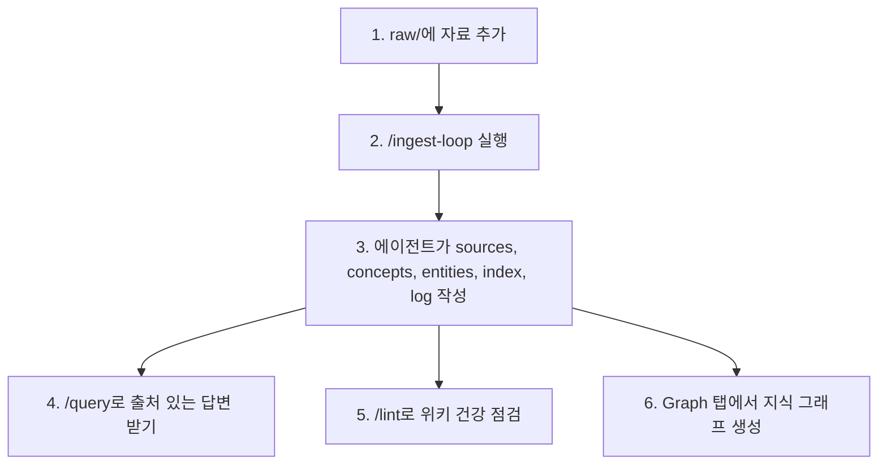
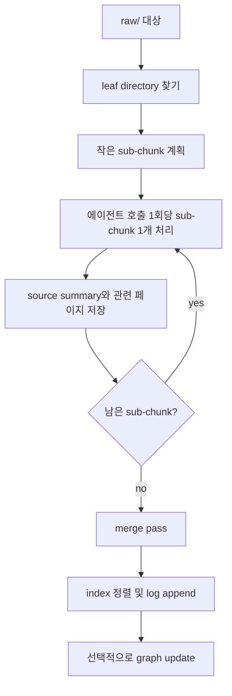

# CLIO 사용자 가이드

이 문서는 CLIO를 처음 보는 사용자가 설치부터 실제 위키 운영까지 따라 할 수 있도록 만든 통합 안내서입니다. 첫 실행 안내와 QA 체크리스트를 하나로 합치고, raw 데이터 추가 방법, ingest/query/lint/graph 운영법, 점검 절차, 문제 해결 방법을 더 자세히 설명합니다.

English guide: [GUIDE.md](./GUIDE.md)

## 1. CLIO란?

CLIO는 로컬 우선(local-first) LLM Wiki 워크벤치입니다.

사용자는 원본 자료를 `raw/`에 모읍니다. 선택한 코딩 에이전트는 그 자료를 읽고 `wiki/` 아래에 사람이 읽을 수 있는 Markdown 위키를 유지합니다. 브라우저 UI에는 다섯 가지 주요 탭이 있습니다.

| 탭 | 할 수 있는 일 |
|---|---|
| Chat | `/ingest-loop`, `/query`, `/lint` 같은 에이전트 작업 실행 |
| Explorer | 원본 파일, 위키 페이지, 로그, 리포트 탐색 |
| Graph | 지식 그래프 빌드 및 업데이트 |
| Automations | 여러 CLI로 주기 작업을 실행하고 `raw/automation/`에 draft-only 기록 저장 |
| Settings | 기본 에이전트 CLI, 서버, 자동 인제스트, 자동 Lint, 언어/테마, 그래프, 비밀번호 설정 |

핵심 흐름은 다음과 같습니다.



CLIO는 단순히 문서에 채팅하는 도구가 아닙니다. 중요한 결과물은 `wiki/`에 남는 Markdown 파일입니다. 이 파일들은 사람이 읽고, 검색하고, 검토하고, 백업하고, 버전 관리할 수 있습니다.

### 현재 구현 상태 요약

현재 CLIO 앱에는 첫 실행 설정과 로그인, 한국어/영어 전환, 네이티브 `clio` CLI, `raw/chat/` 외부 캡처를 지원하는 Chat 세션, Explorer 파일 탐색과 허용된 위치의 업로드/이름 변경/삭제 동작, Cytoscape 기반 Graph 보기, 자동 인제스트, 자동 Lint, draft-only 예약 Automations, 릴리스/업데이트 스크립트, 선택적 systemd 서비스 설치가 구현되어 있습니다.

프로젝트 스킬, 그래프 출력 형식, 자동화 템플릿, 설치 편의성은 계속 발전 중인 인터페이스입니다. 릴리스 사이에서 세부 동작이 바뀔 수 있습니다.

## 2. 기본 개념

### 사용자가 소유하는 원본 영역: `raw/`

`raw/`는 원본 자료를 넣는 곳입니다.

- 개인 노트
- Markdown 파일
- 텍스트 파일
- 웹 문서 복사본
- 회의록
- 문서 export 결과
- 텍스트 선택이 가능한 PDF
- 이미지나 스캔 PDF를 설명하는 보조 Markdown 노트

에이전트는 `raw/`를 읽기 전용으로 취급해야 합니다. 원본 자료를 수정, 삭제, 이동하지 않는 것이 이 프로젝트의 강한 규칙입니다.

단, Chat에서 사용자가 명시적으로 assistant 메시지를 저장하면 외부 조사 캡처가 `raw/chat/` 아래에 append-only로 생성될 수 있습니다. 이 경로는 브라우저/검색/도구로 얻은 내용을 나중에 `/ingest`할 원자료 후보로 보존하기 위한 곳이며, 전체 대화 원문은 계속 `sessions/`에 남습니다.

### 에이전트가 관리하는 위키: `wiki/`

`wiki/`는 에이전트가 생성하고 관리하는 지식 저장소입니다.

- `wiki/sources/YYYY/YYYY-MM/<slug>.md` - 원본 자료별 요약 페이지
- `wiki/entities/` 또는 유사 경로 - 사람, 조직, 제품, 프로젝트 같은 개체 페이지
- `wiki/concepts/` 또는 유사 경로 - 개념, 방법론, 패턴 페이지
- `wiki/answers/` - 저장한 질의응답 결과
- `wiki/lint/` - 위키 점검 리포트
- `wiki/graph/` - 그래프 JSON, 그래프 리포트, 부분 그래프 상태
- `wiki/index.md` - 위키 목차
- `wiki/log.md` - append-only 운영 로그

한 번의 ingest로 완벽한 위키가 만들어진다고 기대하지 않는 편이 좋습니다. 좋은 LLM Wiki는 ingest, query, answer 저장, lint, 수동 큐레이션이 반복되면서 점점 좋아집니다.

### 프로젝트 스킬

`.agents/skills/`에는 CLIO 작업 방식을 정의하는 프로젝트 로컬 스킬이 들어 있습니다.

| 스킬 | 트리거 | 목적 |
|---|---|---|
| `wiki-ingest` | `/ingest`, `/ingest-loop` | `raw/` 자료를 청크 단위로 읽고 `wiki/`를 갱신 |
| `wiki-query` | `/query`, 일반 질문 | 위키 우선으로 검색하고 출처 있는 답변 작성 |
| `wiki-lint` | `/lint` | 깨진 링크, 메타데이터 누락, 충돌, 보안 패턴 점검 |
| `wiki-graphify` | Graph 탭, 그래프 요청 | `wiki/graph/` 그래프 산출물 생성 및 갱신 |
| `wiki-search-qmd` | 선택 도구 | qmd가 있으면 검색과 재랭킹 보조 |
| `wiki-marp` | 선택 도구 | Marp가 있으면 슬라이드 형식 답변 생성 |

## 3. 요구 사항

### 설치 스크립트에 필요한 것

- `bash`
- `tar`
- `curl` 또는 `wget`

### 전체 기능에 필요한 것

- Node.js `>=20`
- npm
- Python 3
- 지원되는 코딩 에이전트 CLI 중 하나 이상:
  - `codex`
  - `claude`
  - `agy` (Antigravity)
  - `cline`

### 선택 도구

- 필요 시 `clio` CLI를 소스에서 빌드하기 위한 Rust 툴체인(`cargo`).
  릴리스 설치는 먼저 Ubuntu, Windows, macOS용 prebuilt `clio` asset을
  내려받고, 현재 환경에 맞는 asset이 없을 때만 `cargo` 빌드로
  넘어갑니다. 웹앱은 CLI 없이도 동작합니다.
- 공식 `graphifyy` Python 패키지의 `graphify` 명령
- 검색/재랭킹 보조용 `qmd`
- 슬라이드 답변 생성을 위한 Marp CLI

`setup.sh`는 기본적으로 graphify 설치 또는 업그레이드를 시도합니다. 원하지 않으면 `--skip-graphify`를 사용하세요. 코딩 에이전트 CLI는 자동 감지하지만 기본적으로 자동 설치하지 않습니다. 필요하면 `--install-cli=codex,claude,agy`처럼 명시적으로 요청할 수 있습니다.

브라우저 기반 자동화 작업이 필요하다면 `./setup.sh --with-agent-browser`로 선택 도구인 `agent-browser` 설치를 best-effort로 시도할 수 있습니다.

## 4. 설치하기

### 권장 릴리스 설치

아래 명령은 최신 GitHub 릴리스를 `~/.clio`에 설치하고 설정 후 웹앱을 시작합니다.

```bash
curl -fsSL https://raw.githubusercontent.com/hjhun/llm-wiki/main/scripts/install.sh | bash -s -- --start
cd ~/.clio
```

이 명령이 하는 일:

1. 최신 GitHub 릴리스 태그를 확인하고 해당 소스 아카이브를 내려받습니다.
2. 기본 설치 디렉터리인 `~/.clio`에 압축을 풉니다.
3. `setup.sh`를 실행해 웹앱을 빌드하고, 가능하면 릴리스 asset에서
   `clio` CLI를 설치합니다.
4. 웹앱을 백그라운드로 시작합니다.

`~/.clio`가 이미 CLIO 설치본이면 설치 스크립트를 다시 실행해도 `raw/`, `wiki/`, `sessions/`, 로컬 설정, 런타임 파일, 웹앱 빌드/의존성 산출물은 보존하고 프로젝트 파일만 새 릴리스/ref로 갱신합니다. 별도 설치본을 만들고 싶으면 다른 경로를 지정하세요.

```bash
curl -fsSL https://raw.githubusercontent.com/hjhun/llm-wiki/main/scripts/install.sh | bash -s -- --dir ./my-clio --start
cd my-clio
```

기존 설치본을 업데이트하면서 원본 자료와 위키 데이터는 보존하려면 다음처럼 실행합니다.

```bash
curl -fsSL https://raw.githubusercontent.com/hjhun/llm-wiki/main/scripts/install.sh | bash -s -- update --dir ~/.clio --start
```

이미 설치 디렉터리 안에 있다면 `--dir`은 생략할 수 있습니다.

```bash
bash scripts/install.sh update --skip-build
```

### Git 체크아웃으로 설치

CLIO 자체를 개발하거나 저장소를 직접 추적하고 싶을 때 사용합니다.

```bash
git clone https://github.com/hjhun/llm-wiki.git
cd llm-wiki
./setup.sh
./setup.sh --start
```

### 자주 쓰는 설치 옵션

```bash
curl -fsSL https://raw.githubusercontent.com/hjhun/llm-wiki/main/scripts/install.sh | bash -s -- --dir ./research-wiki --port 7788 --skip-graphify --start
```

| 옵션 | 설명 |
|---|---|
| `install` | 기본 command. 새 설치 디렉터리를 만들거나, 대상이 기존 CLIO 설치본이면 사용자 데이터를 보존한 채 프로젝트 파일을 갱신합니다 |
| `update`, `upgrade` | 선택한 릴리스/ref에서 기존 설치본을 업데이트합니다. `raw/`, `wiki/`, `sessions/`, 로컬 설정, 런타임 파일, 웹앱 빌드/의존성 산출물은 보존합니다 |
| `--dir <path>` | 설치 디렉터리. 기본값은 `~/.clio` |
| `--version <ver>` | 설치할 GitHub 릴리스 태그 또는 `latest`. 기본값은 `latest` |
| `--ref <ref>` | GitHub 태그, 브랜치, 커밋을 정확히 설치. `--version`보다 우선합니다 |
| `--repo <repo>` | GitHub 저장소. 기본값은 `hjhun/llm-wiki` |
| `--no-setup` | 다운로드와 압축 해제만 수행 |

그 밖의 인자는 `setup.sh`로 전달됩니다.

특정 릴리스를 설치하려면 다음처럼 실행합니다.

```bash
curl -fsSL https://raw.githubusercontent.com/hjhun/llm-wiki/main/scripts/install.sh | bash -s -- --version v0.1.0
```

## 5. 웹앱 실행과 종료

시작 또는 재시작:

```bash
./setup.sh --start
```

브라우저에서 열기:

```text
http://127.0.0.1:9091
```

종료:

```bash
./setup.sh --shutdown
```

런타임 파일:

```text
.run/webapp.pid
.run/webapp.log
```

포트가 이미 사용 중이면 다른 포트를 지정할 수 있습니다.

```bash
./setup.sh --port 7788 --start
```

이 컴퓨터에서만 접속하도록 제한하려면:

```bash
./setup.sh --host 127.0.0.1 --start
```

기본 host는 `0.0.0.0`입니다. 같은 LAN의 다른 기기에서 `http://<server-ip>:9091`로 접속할 수 있습니다. 신뢰할 수 있는 네트워크에서만 이 기본값을 사용하세요.

### systemd로 자동 시작하기

Ubuntu 22.04/24.04 또는 다른 systemd 기반 호스트에서는 재부팅 후 또는 비정상 종료 후 CLIO가 다시 시작되도록 서비스로 등록할 수 있습니다.

```bash
./systemd/install-clio-web-service.sh
```

설치 스크립트가 하는 일:

- 필요하면 `npm install`을 실행하고 `npm run build`로 웹앱을 준비합니다.
- `systemd/clio-web.service` 템플릿을 현재 checkout 경로와 실행 사용자에 맞게 렌더링합니다.
- 기본적으로 `/etc/systemd/system`에 unit 파일을 설치합니다.
- `systemctl daemon-reload`를 실행합니다.
- `systemctl enable clio-web.service`를 실행합니다.
- 서비스를 재시작합니다.

스크립트는 systemd unit 설치와 제어가 필요한 단계에서만 `sudo`를 사용합니다. Ubuntu가 필요한 시점에 sudo 비밀번호를 물어봅니다. unit에는 `WantedBy=multi-user.target`이 들어 있으므로, `systemctl enable`이 적절한 `multi-user.target.wants/` 심볼릭 링크를 만듭니다.

로컬 관리자용 기본 위치가 아니라 Ubuntu vendor-style unit 위치를 쓰고 싶다면 다음처럼 실행합니다.

```bash
./systemd/install-clio-web-service.sh --unit-dir vendor
```

`vendor`는 `/usr/lib/systemd/system`이 있으면 그 경로를 사용하고, 없으면 `/lib/systemd/system`으로 fallback합니다. 절대 경로를 직접 지정할 수도 있습니다.

```bash
./systemd/install-clio-web-service.sh --unit-dir /usr/lib/systemd/system
```

자주 쓰는 서비스 명령:

```bash
sudo systemctl status clio-web.service
sudo journalctl -u clio-web.service -f
sudo systemctl restart clio-web.service
sudo systemctl disable --now clio-web.service
```

### `clio` 명령줄 인터페이스 사용하기

`setup.sh`는 네이티브 Rust CLI를 빌드해 `<설치 디렉터리>/bin/clio`에
설치합니다. 이 CLI는 Chat 탭과 동일한 작업을 수행하므로 브라우저 없이도
터미널에서 위키를 관리할 수 있습니다.

바이너리를 `PATH`에 추가합니다(필요할 때 설치 스크립트가 이 줄을 출력합니다).

```bash
export PATH="$HOME/.clio/bin:$PATH"
```

원본 자료 관리 — 다음 명령은 웹앱 없이 동작하며 파일 시스템만 다룹니다.

```bash
clio raw add ~/Downloads/paper.pdf            # raw/ 안으로 복사
clio raw add ./notes/ --dest research/notes   # 폴더를 raw/research/notes 로 복사
clio raw list                                 # raw/ 아래 전체 목록
clio raw remove research/old.md               # raw/.trash/ 로 소프트 삭제
```

`raw/`에 이미 있는 경로에 `clio raw add`를 다시 실행하면, 기존 바이트를
먼저 `raw/.trash/`에 백업한 뒤 새 내용으로 교체합니다. 즉 기존 파일을
다시 add하면 사실상 업데이트로 동작합니다.

서버 관리와 위키 작업:

```bash
clio start                                   # 웹앱 시작
clio restart                                # systemd 또는 setup.sh fallback으로 재시작
clio shutdown                               # 웹앱 종료
clio ingest raw/research                      # /ingest 1회 패스
clio ingest-loop raw/research                 # 해당 경로가 끝날 때까지 /ingest-loop
clio query "위키가 검색에 대해 뭐라고 하나요?"
clio lint --fix                               # wiki-lint 건강 점검
clio status                                   # 프로젝트, 웹앱 URL, 토큰 표시
```

`clio start`, `clio shutdown`, `clio restart`는 `clio-web.service`가 설치되어
있으면 systemd를 사용합니다. service file이 없는 시스템에서는 로컬
`setup.sh` 서버 제어로 fallback합니다. `ingest`, `ingest-loop`, `query`,
`lint`는 웹앱 HTTP API를 거치므로 Settings에서 설정한 코딩 에이전트를
그대로 사용하고, Chat 탭과 동일한 세션 로그·진행 대시보드·그래프
업데이트를 생성합니다.

CLI는 프로젝트를 자동으로 찾습니다. `$CLIO_HOME`, 그다음 현재
디렉터리에서 위로 거슬러 올라가며 탐색하고, 마지막으로 `~/.clio`를
사용합니다. 웹앱 포트와
베어러 토큰(`auth.cliToken`)은 `setup.sh`가 생성하는 `config/local.json`에서
읽습니다. `--home`, `--base-url`, `--token` 옵션(또는 대응하는 `CLIO_HOME` /
`CLIO_BASE_URL` / `CLIO_TOKEN` 환경 변수)으로 각 값을 덮어쓸 수 있습니다.

## 6. 첫 로그인

1. `http://127.0.0.1:9091`을 엽니다.
2. 첫 실행이면 `/setup`으로 이동합니다.
3. 관리자 비밀번호를 설정합니다. 비밀번호는 6자 이상이어야 합니다.
4. 로그인합니다.
5. **Settings** 탭을 엽니다.
6. 기본 코딩 에이전트 CLI를 선택합니다.

비밀번호 해시와 세션 시크릿은 `config/local.json`에 저장됩니다. 이 파일은 git 추적에서 제외되어 있습니다.

비밀번호를 수동으로 초기화하려면:

1. 서버를 종료합니다.
2. `config/local.json`을 엽니다.
3. `auth.passwordHash`와 `auth.sessionSecret`을 `null`로 바꿉니다.
4. 서버를 다시 시작합니다.
5. `/setup`에서 새 비밀번호를 설정합니다.

## 7. 기본 코딩 에이전트 선택

CLIO의 ingest/query/lint/graph 작업은 웹앱 자체가 직접 수행하지 않습니다. Settings에서 선택한 코딩 에이전트 CLI로 요청을 보냅니다.

지원 CLI:

| CLI | 호출 형태 |
|---|---|
| `codex` | `codex exec "<prompt>"` |
| `claude` | `claude -p "<prompt>"` |
| `agy` (Antigravity) | `agy --prompt "<prompt>"` |
| `cline` | `cline -y "<prompt>"` |

**Settings**에서:

1. 감지된 CLI 목록을 확인합니다.
2. 사용할 CLI의 **Use** 버튼을 누릅니다.
3. `/ingest`, `/ingest-loop`, `/query`, `/lint`에 사용할 최대 동시 에이전트 수와 이름 prefix를 조정합니다. 기본값은 2개이며 워커 이름은 `agent-1`, `agent-2`처럼 붙습니다.
4. CLI가 보이지 않으면 호스트에 설치하거나 수동 경로를 입력합니다.
5. 저장합니다.

선택한 CLI는 웹앱을 실행하는 같은 사용자 계정과 환경에서 로그인되어 있어야 합니다. 예를 들어 쉘에서는 `codex`가 작동하는데 CLIO에서는 실패한다면, 같은 쉘에서 CLIO를 다시 시작하여 `HOME`, `PATH`, 인증 환경이 이어지게 하세요.

## 8. raw 데이터 추가하기

### 추천 폴더 구조

자료의 주제와 묶음을 알 수 있게 폴더를 나누는 것이 좋습니다.

```text
raw/
├── articles/
│   └── 2026-05-llm-wiki/
│       ├── karpathy-llm-wiki.md
│       └── follow-up-notes.md
├── papers/
│   └── retrieval/
│       ├── rag-paper.pdf
│       └── reading-notes.md
├── meetings/
│   └── 2026-05-17-design-review.md
└── web-clips/
    └── graphify-readme.md
```

CLIO는 leaf directory를 먼저 처리합니다. leaf directory는 자식 디렉터리가 없는 디렉터리입니다. 위 구조에서는 `raw/articles/2026-05-llm-wiki/`, `raw/papers/retrieval/`, `raw/meetings/`, `raw/web-clips/`가 leaf directory입니다.

### 좋은 raw 데이터 습관

- 파일명은 구체적으로 작성합니다.
- 가능하면 `.md`, `.txt`, HTML export, 회의록, 텍스트가 선택 가능한 PDF처럼 텍스트를 읽기 쉬운 형식을 사용합니다.
- 스캔 PDF나 이미지는 OCR을 먼저 하거나, 보이는 내용을 설명하는 Markdown 보조 노트를 함께 넣습니다.
- 하나의 주제, 프로젝트, 회의, 논문 묶음, 출처 묶음을 하나의 폴더에 담습니다.
- credential, API key, private token, 불필요한 개인정보를 `raw/`에 넣지 않습니다.
- 원본 자료를 `wiki/`에 보관하지 마세요. 원본은 `raw/`, 생성 요약과 지식은 `wiki/`입니다.

### 데모 자료 추가

```bash
mkdir -p raw/demo
cp examples/raw/llm-wiki-demo.md raw/demo/
```

### 선택 사항: 노이즈가 많은 raw 데이터 전처리

광고, 내비게이션, footer, 빈 파일, 중복 snapshot처럼 명확한 노이즈가 `raw/` 폴더에 섞여 있을 때 preprocess를 사용합니다. preprocess는 반드시 두 단계로 동작합니다.

```text
/preprocess raw/<path> navigation/footer boilerplate와 빈 snapshot 제거
```

dry-run은 `wiki/.progress/preprocess/` 아래에 계획을 쓰고, 변경될 내용을 요약합니다. 이 계획을 검토한 뒤에만 적용합니다.

```text
/preprocess --apply
```

apply 단계에서는 파일 전체를 `raw/.trash/`로 옮기거나, 원본을 `raw/.trash/`에 백업한 뒤 파일 내용을 제자리에서 정리할 수 있습니다. 이 workflow 밖에서 에이전트는 `raw/`를 immutable로 취급해야 합니다.

## 9. 데이터 인제스트하기

### 권장 명령

일반적인 사용에서는 **Chat** 탭에 다음을 입력합니다.

```text
/ingest-loop raw/demo
```

`raw/` 전체를 점진적으로 처리하려면:

```text
/ingest-loop
```

`/ingest-loop`는 작업이 끝나거나 사용자가 중단할 때까지 ingest를 반복 호출합니다. 처음 사용하는 사용자에게 가장 적합한 방식입니다.

### 수동 단계 실행

한 번에 한 sub-chunk만 조심스럽게 처리하려면:

```text
/ingest raw/demo
```

`/ingest`는 정확히 한 sub-chunk를 처리하고 종료합니다. 남은 작업이 있으면 다시 실행해야 합니다.

### ingest 후 생성되는 파일

성공하면 다음과 같은 파일들이 생성되거나 갱신됩니다.

```text
wiki/sources/YYYY/YYYY-MM/<source-summary>.md
wiki/concepts/<concept>.md
wiki/entities/<entity>.md
wiki/index.md
wiki/log.md
wiki/.progress/ingest/.state.json
wiki/.progress/ingest/DASHBOARD.md
sessions/YYYY-MM-DD/<time>_ingest*.md
```

concept/entity 경로와 파일명은 에이전트가 자료를 해석한 결과에 따라 달라질 수 있습니다.

### leaf-first + merge pass가 필요한 이유

큰 폴더를 한 번에 처리하면 에이전트 컨텍스트나 메모리 한계를 넘기 쉽습니다. CLIO는 이를 피하기 위해 leaf-first merge 방식을 사용합니다.



이 방식 덕분에 중간에 실패해도 재개할 수 있습니다. 다음 실행은 `wiki/.progress/ingest/.state.json`을 읽고 미완료 청크부터 이어갑니다.

## 10. 위키에 질문하기

**Chat** 탭에서 질문합니다.

```text
/query Why is the leaf-first merge pass necessary in LLM Wiki?
```

`/query` 없이 일반 질문을 입력해도 query 흐름으로 처리됩니다.

예상 흐름:

1. 에이전트가 `wiki/index.md`를 읽습니다.
2. 후보 위키 페이지를 고릅니다.
3. qmd나 graph context가 있으면 보조 검색 신호로 사용할 수 있습니다.
4. 실제 후보 페이지를 읽습니다.
5. 출처가 포함된 답변을 작성합니다.
6. 필요하면 `wiki/answers/`에 답변을 저장하도록 제안합니다.

예시 질문:

```text
/query graphify를 언급한 source는 무엇인가요?
/query raw/와 wiki/의 역할을 표로 비교해 주세요.
/query --scope=wiki+raw 프로젝트 노트에서 아직 열린 질문은 무엇인가요?
/query --save 이 위키의 가장 중요한 설계 결정을 요약해 주세요.
```

qmd와 graphify는 보조 도구입니다. 최종 답변은 위키 페이지, source summary, 읽기 전용 raw 자료에 근거해야 합니다.

## 11. 지식 그래프 만들기

**Graph** 탭을 엽니다.

사용 버튼:

- **Build** - 전체 그래프 새로 생성
- **Incremental Update** - 변경된 leaf 중심으로 그래프 갱신

그래프 캔버스는 Cytoscape를 사용합니다. 마우스 휠과 드래그로 그래프를
확대/축소하고 이동할 수 있으며, `Ctrl`/`Cmd` + 휠은 브라우저 전체가 아니라
캔버스 안의 그래프에만 적용됩니다. 노드를 선택하면 1-hop 이웃이 강조되고
inspector에서 연결된 source 문서를 미리 볼 수 있습니다.

생성 파일:

```text
wiki/graph/graph.json
wiki/graph/GRAPH_REPORT.md
wiki/graph/parts/<path-hash>.json
wiki/graph/.state.json
```

Graph 탭은 graphify를 직접 실행하지 않습니다. 기본 코딩 에이전트에게 `wiki-graphify` 스킬 실행을 요청합니다. 이 스킬은 다음 순서로 실행 경로를 선택합니다.

1. `PATH`에 있는 전역 `graphify`
2. 스크립트가 PATH에 없지만 패키지가 설치된 경우 `python3 -m graphify`

둘 다 작동하지 않으면 setup을 다시 실행합니다.

```bash
./setup.sh
```

또는 graphify를 수동 설치합니다.

```bash
pipx install graphifyy
graphify install
```

`./setup.sh --skip-graphify`를 사용했다면 설치가 생략되므로, 이미 작동하는 전역 `graphify`가 필요합니다.

## 12. 위키 점검과 유지보수

점검:

```text
/lint
```

안전한 자동 수정까지 적용:

```text
/lint --fix
```

lint가 확인하는 항목:

- frontmatter 누락
- 깨진 wikilink
- `wiki/index.md`에 빠진 페이지
- orphan page
- contradiction candidate
- stale claim
- source chronology layout
- graph/wiki mismatch
- 민감정보 패턴

리포트는 다음 위치에 작성됩니다.

```text
wiki/lint/YYYY-MM-DD.md
```

같은 날 여러 번 실행하면 기존 리포트를 덮어쓰지 않고 `_2`, `_3` 같은 suffix를 붙여 새 파일을 만들어야 합니다.

### 자동 Lint

자동 Lint는 **Settings**에서 설정합니다. 두 가지 신호를 사용합니다.

| 신호 | 동작 |
|---|---|
| Counter | 마지막 lint 이후 ingest 로그 entry 수를 세고, 임계값에 도달하면 UI에 lint 권장을 표시합니다. 이 신호만으로 lint를 자동 실행하지는 않습니다. |
| Cron | 활성화하면 매일/매주/매월 일정에 따라 `/lint`를 실행합니다. |

중요 설정:

| 설정 | 의미 |
|---|---|
| Enabled | 자동 Lint 켜기/끄기 |
| Ingest count threshold | UI가 lint 실행을 권장하기 전까지 허용할 ingest 로그 entry 수 |
| Run on a schedule | cron 방식 예약 lint 실행 활성화 |
| Apply `--fix` | 예약 또는 수동 Auto Lint 실행 시 `--fix` 전달 |
| Skip if busy | ingest 또는 lint lock이 있으면 실행 건너뜀 |

## 13. 자동 인제스트

자동 인제스트는 **Settings**에서 설정합니다.

모드:

| 모드 | 동작 |
|---|---|
| Watch | `raw/` 파일 변경을 감지하고 debounce 후 `/ingest-loop` 실행 |
| Schedule | 지정한 주기마다 `/ingest-loop` 실행 |

중요 설정:

| 설정 | 의미 |
|---|---|
| Enabled | 자동 인제스트 켜기/끄기 |
| Debounce | 파일 변경 후 watch-triggered ingest까지 기다리는 시간 |
| Interval | scheduled ingest 실행 간격 |
| Skip if busy | `wiki/.progress/ingest/.lock`이 있으면 이번 트리거를 건너뜀 |

자동 인제스트도 수동 ingest-loop와 같은 드라이버를 사용합니다. 프로젝트 스킬을 우회하지 않습니다.

## 14. Automations

**Automations** 탭에서는 하나 이상의 코딩 에이전트 CLI를 독립 workspace에서 실행하는 주기 작업을 만들 수 있습니다.

각 실행 기록은 다음 위치에 저장됩니다.

```text
raw/automation/<job>/<run>/
```

이 경로는 예약/자동화 실행 산출물 전용입니다. 대화형 Chat에서 저장한 외부 조사 캡처는 `raw/chat/` 아래에 별도로 저장됩니다.

YouTube 요약, GitHub/Gerrit 패치 리뷰, 이메일 sync, custom prompt 템플릿을 사용할 수 있습니다. 외부 쓰기는 기본적으로 draft-only입니다. 즉 리뷰 댓글이나 이메일 초안은 만들 수 있지만, 자동으로 댓글을 업로드하거나 메일을 보내거나 외부 시스템 상태를 바꾸지 않습니다.

여러 CLI를 선택하면 CLIO가 병렬로 실행하고 각 에이전트의 plan/result를 `cli/<agent>/` 아래에 따로 저장합니다.

**Build from prompt** 패널은 개발자가 아닌 사용자를 위한 설정 흐름입니다. 원하는 주기 작업을 자연어로 적고 선호 CLI를 고르면 CLIO가 job 초안, 필요한 도구, 누락 요구사항, 검증 단계, 위험 메모를 제안합니다. `agent-browser` 같은 선택 도구는 먼저 감지하고, allowlist된 설치 명령을 실행하기 전에 사용자에게 확인을 받습니다. 설치 시점에 미리 준비하려면 다음 옵션을 사용할 수 있습니다.

```bash
./setup.sh --with-agent-browser
```

## 15. 설정 파일

기본 설정:

```text
config/default.json
```

로컬 설정:

```text
config/local.json
```

`config/local.json`은 host, port, password hash 같은 로컬 값이 들어갈 수 있으므로 git에서 제외되어 있습니다.

주요 기본값:

| 키 | 기본값 | 의미 |
|---|---:|---|
| `server.port` | `9091` | 웹 UI 포트 |
| `server.host` | `0.0.0.0` | LAN에서 접근 가능한 host binding |
| `agent.orchestration.maxConcurrentAgents` | `2` | ingest/query/lint 작업에 동시에 띄울 수 있는 워커 에이전트 수 |
| `chunking.maxFilesPerInvocation` | `4` | 에이전트 호출 1회당 최대 raw 파일 수 |
| `chunking.maxBytesPerFile` | `131072` | 큰 파일은 head + tail만 읽음 |
| `graph.autoUpdateOnIngest` | `true` | ingest 진행 후 graph 동기화 실행 |
| `graph.autoUpdateStrategy` | `auto` | `auto`는 작은 ingest에서는 scoped graph update를 생략하고 큰 작업에서만 실행합니다. `finalOnly`는 최종 update만 기다리고, `partialAndFinal`은 scoped update와 최종 update를 모두 실행합니다. scoped update는 대상 leaf partial을 갱신한 뒤 전체 graph parts를 병합합니다. |
| `graph.partialThresholds` | `{ minLeaves: 4, minFiles: 16, minBytes: 1048576, minSubChunks: 4 }` | `auto`가 최종 graph update 전 scoped graph update 실행 여부를 판단할 때 쓰는 작업 규모 임계값 |
| `autoIngest.enabled` | `false` | 자동 인제스트 기본 비활성화 |
| `autoLint.enabled` | `false` | 자동 Lint 기본 비활성화 |
| `autoLint.counter.threshold` | `10` | lint 권장을 표시하는 ingest 로그 entry 수 |
| `autoLint.cron.enabled` | `false` | 예약 lint 실행 기본 비활성화 |
| `automation.enabled` | `false` | 자동화 스케줄러 기본 비활성화 |

가능하면 UI에서 설정을 바꾸고, 수동 편집은 필요한 경우에만 하세요.

## 16. QA 체크리스트

설치 후, 릴리스 전, 큰 변경 후에 사용하세요.

### 정적 점검과 빌드 점검

```bash
./scripts/smoke-test.sh
```

확인 항목:

- 필수 파일 존재
- `setup.sh` 문법
- `scripts/install.sh` 문법
- setup help 출력
- installer help 출력
- 네트워크가 필요 없는 idempotent setup 경로
- webapp typecheck
- webapp production build

### 수동 웹 점검

개발 모드 시작:

```bash
./setup.sh --start --dev --skip-build
```

브라우저:

```text
http://127.0.0.1:9091
```

확인:

- `/setup`에서 비밀번호 설정 가능
- 로그인 가능
- Settings에서 기본 코딩 에이전트 선택 가능
- Explorer에서 `wiki/index.md`, `wiki/log.md` 열기 가능
- Chat에서 메시지 전송 가능
- Graph 탭이 empty state 또는 현재 graph state 표시
- Build 버튼이 보임
- Automations 탭이 열리고 scheduler 상태가 보임
- Settings에서 자동 인제스트와 자동 Lint 패널이 보임

종료:

```bash
./setup.sh --shutdown
```

### 샘플 ingest 점검

```bash
mkdir -p raw/demo
cp examples/raw/llm-wiki-demo.md raw/demo/
```

Chat 탭:

```text
/ingest-loop raw/demo
```

예상 결과:

- `wiki/sources/YYYY/YYYY-MM/` 아래 source summary 생성
- 관련 concept/entity 페이지 생성 또는 갱신
- `wiki/index.md` 갱신
- `wiki/log.md`에 ingest entry append

### query 점검

Chat 탭:

```text
/query Why is the leaf-first merge pass necessary?
```

예상 결과:

- 답변에 위키 페이지 citation 포함
- 근거 없는 주장 없음
- 선택적으로 `wiki/answers/` 저장 안내 표시

### graph 점검

Graph 탭:

1. **Build**를 누릅니다.
2. 코딩 에이전트가 끝날 때까지 기다립니다.

예상 결과:

- `wiki/graph/graph.json` 생성
- `wiki/graph/GRAPH_REPORT.md` 생성
- Graph 탭에 node, edge, community count 표시

### 커밋 전 민감 파일 확인

```bash
git status --short
```

일반적으로 커밋하면 안 되는 파일:

- `config/local.json`
- `config/cli-detected.json`
- `.run/*`
- `sessions/**`
- `webapp/.next/**`
- `webapp/node_modules/**`
- 공개할 의도가 없는 local raw data

## 17. 문제 해결

### 포트가 이미 사용 중일 때

```bash
./setup.sh --shutdown
./setup.sh --start
```

또는 다른 포트를 사용합니다.

```bash
./setup.sh --port 7788 --start
```

### 코딩 에이전트가 감지되지 않을 때

1. `codex`, `claude`, `agy`, `cline` 중 하나를 설치합니다.
2. 쉘에서 동작하는지 확인합니다.

```bash
codex --version
# 또는
claude --version
```

3. 같은 쉘에서 CLIO를 다시 시작합니다.
4. Settings에서 CLI를 선택합니다.
5. 필요하면 CLI 절대 경로를 수동 입력합니다.

### Chat에서 기본 에이전트가 없다고 할 때

Settings를 열고 감지된 CLI의 **Use** 버튼을 누른 뒤 저장합니다.

### Graph Build가 API key를 요구할 때

이 통합에서 graphify 자체는 별도 API key를 요구하지 않는 것이 정상입니다. 보통 선택한 코딩 에이전트 CLI가 웹앱 프로세스 환경에서 로그인되어 있지 않다는 뜻입니다.

해결:

1. CLIO를 종료합니다.
2. 해당 CLI가 정상 작동하는 쉘을 엽니다.
3. 그 쉘에서 CLIO를 다시 시작합니다.

```bash
./setup.sh --start
```

### ingest가 멈춘 것처럼 보일 때

다음을 확인합니다.

```text
wiki/.progress/ingest/DASHBOARD.md
wiki/.progress/ingest/.state.json
wiki/log.md
.run/webapp.log
```

lock이 있는데 실행 중인 ingest 프로세스가 없다면 다음 파일을 확인합니다.

```text
wiki/.progress/ingest/.lock
```

실제로 실행 중인 ingest가 없다고 확신할 때만 stale lock을 제거하세요.

### 비밀번호 초기화

1. 서버를 종료합니다.
2. `config/local.json`을 엽니다.
3. 아래처럼 설정합니다.

```json
{
  "auth": {
    "passwordHash": null,
    "sessionSecret": null,
    "sessionTtlSec": 86400
  }
}
```

4. 서버를 시작합니다.
5. `/setup`에 접속합니다.

### raw 데이터가 실수로 변경되었을 때

에이전트는 `raw/`를 수정하면 안 됩니다. `raw/` 아래 파일이 예상치 않게 변경되었다면:

1. ingest를 중단합니다.
2. 백업이나 git 이력이 있다면 원본을 복구합니다.
3. `wiki/log.md`에 새 entry를 append하여 상황을 기록합니다.
4. `/lint`를 실행해 생성 페이지 상태를 점검합니다.

## 18. 일상적인 사용 예시

1. 새 기사, 노트, PDF, 회의록을 명확한 `raw/` 폴더 아래에 저장합니다.
2. Chat 탭에서 실행합니다.

```text
/ingest-loop raw/<folder>
```

3. Explorer에서 생성된 source summary를 읽습니다.
4. 질문합니다.

```text
/query 이번에 추가한 자료에서 가장 중요한 주장은 무엇인가요?
```

5. 유용한 답변은 `wiki/answers/`에 저장합니다.
6. 점검합니다.

```text
/lint
```

7. Graph 탭에서 그래프를 Build 또는 Incremental Update 합니다.
8. 보존할 지식 베이스라면 `wiki/`를 커밋하거나 백업합니다.

## 19. 다음 문서

| 문서 | 내용 |
|---|---|
| [README.md](../README.md) | 프로젝트 개요와 빠른 시작 |
| [AGENTS.md](../AGENTS.md) | 코딩 에이전트 운영 규칙 |
| [CLAUDE.md](../CLAUDE.md) | Claude용 동일 운영 규칙 |
| [IDEATION.md](./IDEATION.md) | 제품 및 아키텍처 배경 |
| [tools/README.md](../tools/README.md) | graphify, qmd, Marp 안내 |
